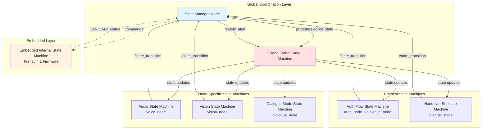
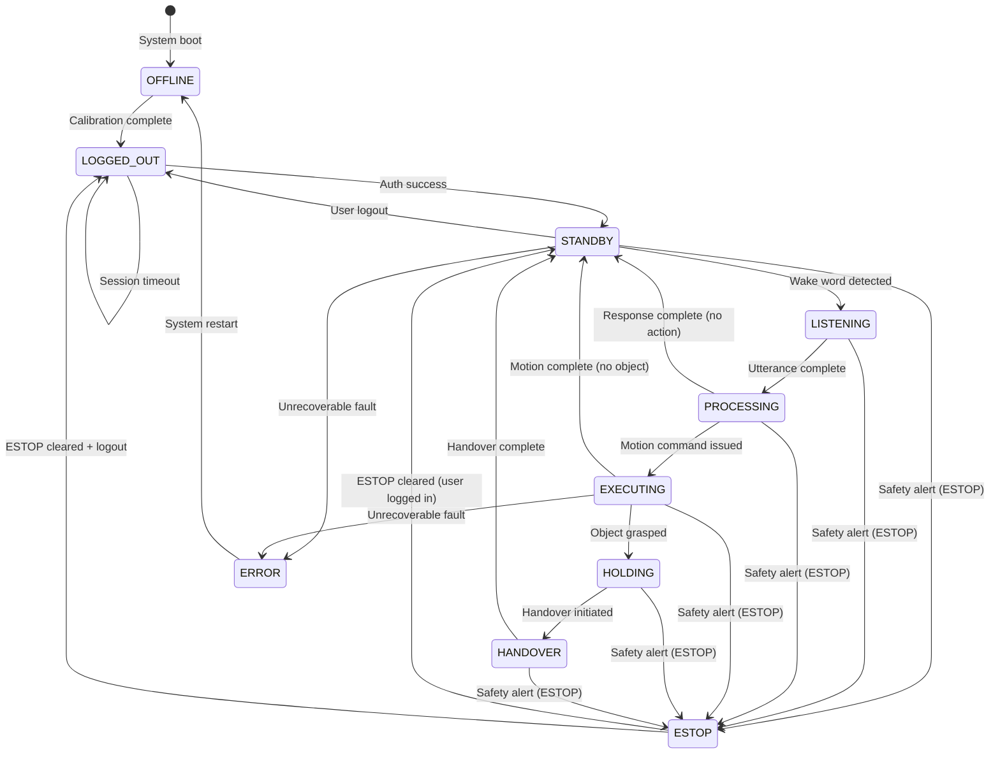
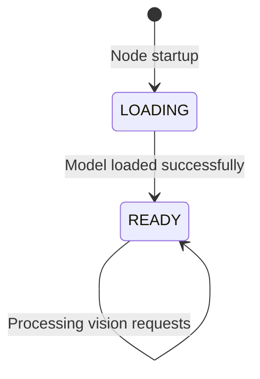
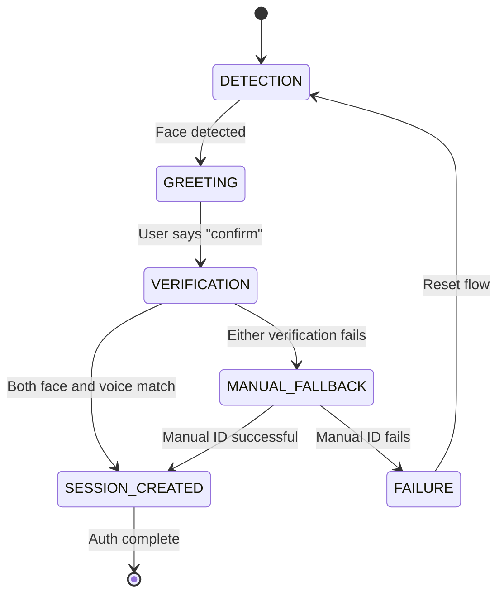
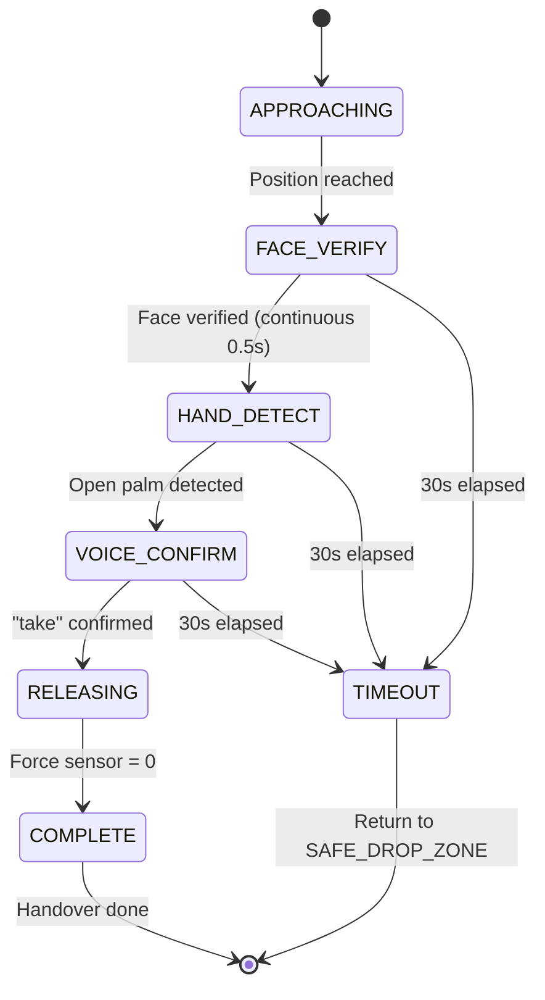
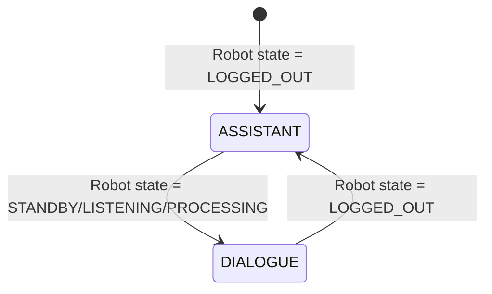
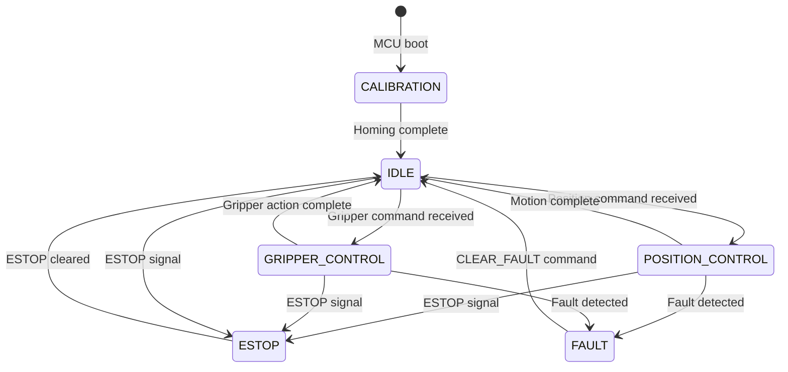

# Design Document: State Machine Implementation for ACARE Robotic System

## Overview

This design document specifies the complete implementation of all state machines, finite state machines (FSMs), and state diagrams for the ACARE robotic system software layer. The system employs a hierarchical state machine architecture with seven distinct state machines operating across different layers: a global robot state machine coordinating system-wide behavior, node-specific state machines managing local concerns (audio, vision, dialogue), and integration state machines handling authentication flows and handover protocols. Each state machine enforces atomic transitions, integrates graded safety severity handling, and maintains state persistence for recovery after power failures. The design emphasizes deterministic behavior, clear separation of concerns, and robust error handling across all operational modes.

## Architecture

The ACARE state machine architecture follows a layered approach with clear separation between global coordination and local node behavior:



### Architectural Principles

1. **Single Source of Truth**: The `state_manager` node owns the global robot state and publishes it via `/robot_state` topic
2. **Atomic Transitions**: All state transitions are atomic and validated before execution
3. **Graded Severity Integration**: Safety alerts with WARNING/CRITICAL/ESTOP severity levels trigger appropriate state responses
4. **State Persistence**: Critical state information persists to SQLite for recovery after power failure
5. **Hierarchical Independence**: Node-specific state machines operate independently but respect global state constraints
6. **Deterministic Behavior**: All state transitions follow explicit rules with no ambiguous conditions

## Components and Interfaces

### Component 1: State Manager Node

**Purpose**: Enforces the global robot state machine, handles state transition requests, integrates graded safety severity, and persists state for recovery.

**Interface**:
```python
class StateManager:
    def __init__(self):
        """Initialize state manager with ROS2 node, publishers, subscribers."""
        pass
    
    def handle_transition_request(self, request: StateTransition) -> bool:
        """
        Process state transition request from any node.
        
        Args:
            request: StateTransition message with target_state, reason, requesting_node
            
        Returns:
            bool: True if transition allowed and executed, False if rejected
        """
        pass
    
    def handle_safety_alert(self, alert: SafetyAlert) -> None:
        """
        Process safety alert and trigger appropriate state response.
        
        Args:
            alert: SafetyAlert with severity (WARNING/CRITICAL/ESTOP), reason, source
        """
        pass
    
    def get_current_state(self) -> RobotState:
        """Return current global robot state."""
        pass
    
    def persist_state(self) -> None:
        """Persist current state to SQLite for recovery."""
        pass
    
    def recover_state(self) -> RobotState:
        """Recover state from SQLite after power failure."""
        pass
    
    def validate_transition(self, from_state: str, to_state: str, context: dict) -> bool:
        """
        Validate if transition is allowed based on current state and context.
        
        Args:
            from_state: Current state
            to_state: Target state
            context: Additional context (user_id, holding_object, etc.)
            
        Returns:
            bool: True if transition is valid
        """
        pass
```

**Responsibilities**:
- Maintain global robot state (OFFLINE, LOGGED_OUT, STANDBY, LISTENING, PROCESSING, EXECUTING, HOLDING, HANDOVER, ESTOP, ERROR)
- Validate and execute state transition requests
- Publish state updates to all nodes via `/robot_state` topic
- Handle graded safety severity (WARNING → log and notify, CRITICAL → reduce velocity, ESTOP → immediate halt)
- Persist state to SQLite every state change
- Recover state on boot after power failure
- Enforce logout rules (only from STANDBY or ESTOP)
- Manage session inactivity timeout (5 minutes → auto-logout)

### Component 2: Audio State Machine (voice_node)

**Purpose**: Manages audio I/O state, microphone muting during TTS, VAD activation, and emergency keyword monitoring.

**Interface**:
```python
class AudioStateMachine:
    def __init__(self):
        """Initialize audio state machine with IDLE state."""
        pass
    
    def transition_to_listening(self) -> None:
        """Transition to LISTENING: unmute mic, activate VAD, open Deepgram WebSocket."""
        pass
    
    def transition_to_transcribing(self) -> None:
        """Transition to TRANSCRIBING: VAD detected utterance end, processing."""
        pass
    
    def transition_to_speaking(self, text: str, priority: str) -> None:
        """
        Transition to SPEAKING: mute mic, play TTS, schedule return to LISTENING.
        
        Args:
            text: Text to speak
            priority: NORMAL or URGENT (URGENT clears queue and hard-cuts current)
        """
        pass
    
    def transition_to_idle(self) -> None:
        """Transition to IDLE: mute mic, close WebSocket, stop all audio."""
        pass
    
    def get_current_state(self) -> str:
        """Return current audio state."""
        pass
    
    def is_mic_muted(self) -> bool:
        """Check if microphone is currently muted."""
        pass
```

**Responsibilities**:
- Manage audio state (IDLE, LISTENING, TRANSCRIBING, SPEAKING)
- Hard-mute microphone during TTS playback
- Add 300ms buffer after TTS to prevent echo triggering VAD
- Maintain emergency keyword thread (ESTOP_LISTEN) parallel to all states
- Coordinate Deepgram WebSocket lifecycle with session state
- Handle TTS priority queue (URGENT messages hard-cut current audio)

### Component 3: Vision State Machine (vision_node)

**Purpose**: Manages vision node initialization, model loading, and operational readiness.

**Interface**:
```python
class VisionStateMachine:
    def __init__(self):
        """Initialize vision state machine with LOADING state."""
        pass
    
    def transition_to_loading(self) -> None:
        """Transition to LOADING: load YOLOv11 TFLite INT8 model."""
        pass
    
    def transition_to_ready(self) -> None:
        """Transition to READY: model loaded, publish /vision_status READY."""
        pass
    
    def get_current_state(self) -> str:
        """Return current vision state (LOADING or READY)."""
        pass
    
    def is_ready(self) -> bool:
        """Check if vision node is ready to process requests."""
        pass
```

**Responsibilities**:
- Manage vision node state (LOADING, READY)
- Load YOLOv11 TFLite INT8 model on startup
- Publish `/vision_status` for planner_node to check before accepting commands
- Block vision search requests until READY state reached

### Component 4: Auth Flow State Machine (auth_node + dialogue_node)

**Purpose**: Coordinates scripted authentication flow with fixed prompts and expected responses.

**Interface**:
```python
class AuthFlowStateMachine:
    def __init__(self):
        """Initialize auth flow state machine."""
        pass
    
    def start_auth_flow(self) -> None:
        """Start authentication flow from DETECTION state."""
        pass
    
    def handle_detection(self, face_embedding: np.ndarray) -> None:
        """
        Handle face detection and transition to GREETING.
        
        Args:
            face_embedding: Face embedding from passive scan
        """
        pass
    
    def handle_greeting_response(self, voice_transcript: str, voice_embedding: np.ndarray) -> None:
        """
        Handle user response to greeting and transition to VERIFICATION.
        
        Args:
            voice_transcript: Transcript of user's "confirm" utterance
            voice_embedding: Voice d-vector extracted from utterance
        """
        pass
    
    def handle_verification_result(self, face_match: bool, voice_match: bool, user_id: str) -> None:
        """
        Handle verification result and transition to SESSION_CREATED or MANUAL_FALLBACK.
        
        Args:
            face_match: True if face verification passed
            voice_match: True if voice verification passed
            user_id: Matched user ID if both passed
        """
        pass
    
    def handle_manual_fallback(self, user_input: str) -> None:
        """Handle manual identification fallback."""
        pass
    
    def handle_failure(self) -> None:
        """Handle authentication failure and reset flow."""
        pass
    
    def get_current_state(self) -> str:
        """Return current auth flow state."""
        pass
```

**Responsibilities**:
- Coordinate scripted auth flow (DETECTION → GREETING → VERIFICATION → SESSION_CREATED)
- Not free conversation — fixed prompts and expected response types per state
- Handle manual fallback if automatic verification fails
- Trigger session creation on successful dual biometric verification
- Reset flow on failure and log UNAUTHORISED_VOICE_ATTEMPT

### Component 5: Handover Substate Machine (planner_node)

**Purpose**: Manages three-check handover verification protocol with incremental approach and real-time palm tracking.

**Interface**:
```python
class HandoverSubstateMachine:
    def __init__(self):
        """Initialize handover substate machine."""
        pass
    
    def start_handover(self, tool: str, user_id: str) -> None:
        """
        Start handover protocol from APPROACHING state.
        
        Args:
            tool: Tool being handed over
            user_id: Authenticated user ID
        """
        pass
    
    def transition_to_face_verify(self) -> None:
        """Transition to FACE_VERIFY: continuous face check every 0.5s."""
        pass
    
    def transition_to_hand_detect(self) -> None:
        """Transition to HAND_DETECT: wait for open palm via MediaPipe."""
        pass
    
    def transition_to_voice_confirm(self) -> None:
        """Transition to VOICE_CONFIRM: prompt 'Say take to receive'."""
        pass
    
    def transition_to_releasing(self) -> None:
        """Transition to RELEASING: open gripper, wait for force sensor = 0."""
        pass
    
    def transition_to_complete(self) -> None:
        """Transition to COMPLETE: handover successful, log event."""
        pass
    
    def handle_timeout(self) -> None:
        """Handle 30-second timeout: return tool to SAFE_DROP_ZONE."""
        pass
    
    def get_current_substate(self) -> str:
        """Return current handover substate."""
        pass
```

**Responsibilities**:
- Manage handover substates (APPROACHING → FACE_VERIFY → HAND_DETECT → VOICE_CONFIRM → RELEASING → COMPLETE)
- Enforce three-check verification: face (continuous 0.5s), hand (open palm up), voice (runtime consistency)
- Handle 30-second timeout with safe deposit to SAFE_DROP_ZONE
- Support height adjustment commands ('lower'/'higher' ±5cm in Z)
- Store per-user height preferences in users.db
- Log HANDOVER_TIMEOUT if collection not confirmed

### Component 6: Dialogue Mode State Machine (dialogue_node)

**Purpose**: Manages dialogue node operating modes based on global robot state.

**Interface**:
```python
class DialogueModeStateMachine:
    def __init__(self):
        """Initialize dialogue mode state machine."""
        pass
    
    def update_mode(self, robot_state: str) -> None:
        """
        Update dialogue mode based on global robot state.
        
        Args:
            robot_state: Current global robot state
        """
        pass
    
    def get_current_mode(self) -> str:
        """Return current dialogue mode (ASSISTANT or DIALOGUE)."""
        pass
    
    def is_assistant_mode(self) -> bool:
        """Check if in ASSISTANT mode (LOGGED_OUT state)."""
        pass
    
    def is_dialogue_mode(self) -> bool:
        """Check if in DIALOGUE mode (STANDBY/LISTENING/PROCESSING)."""
        pass
```

**Responsibilities**:
- Switch between ASSISTANT MODE (when LOGGED_OUT) and DIALOGUE MODE (when STANDBY/LISTENING/PROCESSING)
- ASSISTANT MODE: Groq-powered conversational agent for ACARE intro and auth guidance
- DIALOGUE MODE: LangGraph multi-node graph for intent clarity and clarification
- Automatically transition modes based on `/robot_state` updates

### Component 7: Embedded Internal State Machine (Teensy 4.1 Firmware)

**Purpose**: Manages embedded firmware state for motor control, calibration, and fault handling.

**Interface** (Software understanding only — implementation is embedded domain):
```python
# Software-side interface for understanding embedded state
class EmbeddedStateInterface:
    """
    Software interface for monitoring embedded state machine.
    Actual implementation is in Teensy 4.1 firmware (embedded domain).
    """
    
    def get_embedded_state(self) -> str:
        """
        Read current embedded state from MCU status feedback.
        
        Returns:
            str: IDLE, POSITION_CONTROL, GRIPPER_CONTROL, ESTOP, FAULT, CALIBRATION
        """
        pass
    
    def send_clear_fault(self) -> None:
        """Send CLEAR_FAULT command to MCU after admin inspection."""
        pass
    
    def wait_for_calibration_complete(self, timeout_sec: int = 60) -> bool:
        """
        Wait for CALIBRATION_COMPLETE from MCU on boot.
        
        Args:
            timeout_sec: Maximum wait time in seconds
            
        Returns:
            bool: True if calibration completed, False if timeout
        """
        pass
    
    def get_fault_code(self) -> int:
        """
        Read current fault code from MCU status.
        
        Returns:
            int: 0=OK, 1=Overcurrent, 2=Overtemp, 3=Encoder limit, etc.
        """
        pass
```

**Responsibilities** (Software understanding):
- Monitor embedded state via CAN/UART status feedback
- Wait for CALIBRATION_COMPLETE on boot before accepting commands
- Handle fault codes and trigger ESTOP on critical faults
- Send CLEAR_FAULT after admin inspection
- Understand embedded state transitions for integration

## Data Models

### Model 1: RobotState

```python
from dataclasses import dataclass
from typing import Optional

@dataclass
class RobotState:
    """Global robot state message."""
    state: str  # OFFLINE|LOGGED_OUT|STANDBY|LISTENING|PROCESSING|EXECUTING|HOLDING|HANDOVER|ESTOP|ERROR
    active_user_id: Optional[str] = None
    timestamp: int = 0  # Unix milliseconds
```

**Validation Rules**:
- `state` must be one of the 11 defined states
- `active_user_id` must be None when state is OFFLINE, LOGGED_OUT, or ERROR
- `active_user_id` must be non-None when state is STANDBY, LISTENING, PROCESSING, EXECUTING, HOLDING, or HANDOVER
- `timestamp` must be monotonically increasing

### Model 2: StateTransition

```python
@dataclass
class StateTransition:
    """State transition request message."""
    target_state: str
    reason: str
    requesting_node: str
    context: dict  # Additional context (user_id, holding_object, etc.)
    timestamp: int = 0
```

**Validation Rules**:
- `target_state` must be a valid state name
- `reason` must be non-empty string
- `requesting_node` must be valid node name
- `context` must include `user_id` if transitioning to authenticated states

### Model 3: SafetyAlert

```python
@dataclass
class SafetyAlert:
    """Safety alert message with graded severity."""
    reason: str
    source: str  # voice|lidar|current|temp|velocity|gripper|network
    severity: str  # WARNING|CRITICAL|ESTOP
    timestamp: int = 0
```

**Validation Rules**:
- `severity` must be one of WARNING, CRITICAL, ESTOP
- `source` must be one of the defined sources
- `reason` must describe the specific safety condition

### Model 4: AudioState

```python
@dataclass
class AudioState:
    """Internal audio state for voice_node."""
    state: str  # IDLE|LISTENING|TRANSCRIBING|SPEAKING|ESTOP_LISTEN
    mic_muted: bool
    tts_active: bool
    websocket_open: bool
    timestamp: int = 0
```

**Validation Rules**:
- `mic_muted` must be True when `state` is SPEAKING
- `websocket_open` must be True when `state` is LISTENING or TRANSCRIBING
- ESTOP_LISTEN is parallel to all states (not mutually exclusive)

### Model 5: HandoverSubstate

```python
@dataclass
class HandoverSubstate:
    """Handover protocol substate."""
    substate: str  # APPROACHING|FACE_VERIFY|HAND_DETECT|VOICE_CONFIRM|RELEASING|COMPLETE
    tool: str
    user_id: str
    face_verified: bool = False
    hand_detected: bool = False
    voice_confirmed: bool = False
    start_time: int = 0
    timeout_sec: int = 30
```

**Validation Rules**:
- `substate` must be one of the 6 defined substates
- `face_verified` must be True before transitioning to HAND_DETECT
- `hand_detected` must be True before transitioning to VOICE_CONFIRM
- `voice_confirmed` must be True before transitioning to RELEASING
- Timeout enforced: `current_time - start_time <= timeout_sec * 1000`

### Model 6: StatePersistence

```python
@dataclass
class StatePersistence:
    """State persistence record for SQLite storage."""
    robot_state: str
    active_user_id: Optional[str]
    holding_object: Optional[str]
    last_transition_reason: str
    timestamp: int
```

**Validation Rules**:
- All fields must match current RobotState at time of persistence
- `timestamp` must be Unix milliseconds
- Record written on every state transition

## State Machines

### State Machine 1: Global Robot State Machine

**States**:
1. **OFFLINE**: System booting, waiting for embedded calibration
2. **LOGGED_OUT**: No active session, assistant mode available
3. **STANDBY**: User authenticated, idle, ready for commands
4. **LISTENING**: Actively listening for voice input
5. **PROCESSING**: Processing user utterance, generating response
6. **EXECUTING**: Executing motion command
7. **HOLDING**: Holding object in gripper
8. **HANDOVER**: Active handover protocol in progress
9. **ESTOP**: Emergency stop triggered
10. **ERROR**: Unrecoverable error state

**Transitions**:



**Transition Rules**:

| From State | To State | Trigger | Conditions | Actions |
|------------|----------|---------|------------|---------|
| OFFLINE | LOGGED_OUT | Calibration complete | Embedded state = IDLE | Publish state, persist |
| LOGGED_OUT | STANDBY | Auth success | Dual biometric verified | Create session, persist |
| STANDBY | LISTENING | Wake word | User authenticated | Activate audio FSM |
| LISTENING | PROCESSING | Utterance end | VAD detected silence | Send to dialogue_node |
| PROCESSING | STANDBY | Response only | No motion command | TTS response |
| PROCESSING | EXECUTING | Motion command | Vision ready, path valid | Send to planner_node |
| EXECUTING | STANDBY | Motion complete | No object in gripper | Log completion |
| EXECUTING | HOLDING | Grasp success | Force sensor > threshold | Update holding_object |
| HOLDING | HANDOVER | Handover request | User requests delivery | Start handover FSM |
| HANDOVER | STANDBY | Handover complete | All checks passed | Clear holding_object |
| STANDBY | LOGGED_OUT | Logout command | User says "logout" | Destroy session |
| LOGGED_OUT | LOGGED_OUT | Inactivity timeout | 5 min no interaction | Auto-logout |
| Any | ESTOP | Safety ESTOP | Severity = ESTOP | Halt all motion |
| ESTOP | STANDBY | ESTOP cleared | Admin clears + user active | Resume session |
| ESTOP | LOGGED_OUT | ESTOP cleared | Admin clears + no user | Return to logged out |
| Any | ERROR | Unrecoverable fault | Critical system failure | Log fault, notify admin |

**Logout Constraints**:
- Logout only allowed from STANDBY or ESTOP states
- Cannot logout while EXECUTING, HOLDING, or HANDOVER (must complete or ESTOP first)
- Inactivity timeout (5 minutes) triggers auto-logout from STANDBY

### State Machine 2: Audio State Machine

**States**:
1. **IDLE**: Microphone muted, no audio processing
2. **LISTENING**: Microphone active, VAD monitoring, Deepgram WebSocket open
3. **TRANSCRIBING**: VAD detected utterance end, processing transcript
4. **SPEAKING**: TTS playing, microphone hard-muted
5. **ESTOP_LISTEN**: Parallel emergency keyword monitoring (always active)

**Transitions**:

```mermaid
stateDiagram-v2
    [*] --> IDLE
    IDLE --> LISTENING: Robot state = LISTENING
    LISTENING --> TRANSCRIBING: VAD detects utterance end
    TRANSCRIBING --> SPEAKING: TTS queued
    SPEAKING --> LISTENING: TTS complete + 300ms buffer
    LISTENING --> IDLE: Robot state != LISTENING
    TRANSCRIBING --> IDLE: Robot state != LISTENING
    SPEAKING --> IDLE: Robot state != LISTENING
    
    note right of ESTOP_LISTEN: Parallel thread monitoring<br/>"emergency stop" keyword<br/>Active in all states
```

**Transition Rules**:

| From State | To State | Trigger | Actions |
|------------|----------|---------|---------|
| IDLE | LISTENING | Robot state = LISTENING | Unmute mic, open WebSocket, activate VAD |
| LISTENING | TRANSCRIBING | VAD detects silence | Send audio buffer to Deepgram |
| TRANSCRIBING | SPEAKING | TTS response ready | Mute mic, play TTS audio |
| SPEAKING | LISTENING | TTS playback complete | Wait 300ms, unmute mic, resume VAD |
| Any | IDLE | Robot state != LISTENING | Mute mic, close WebSocket, stop audio |

**Special Behaviors**:
- **ESTOP_LISTEN**: Parallel thread always monitoring for "emergency stop" keyword, triggers immediate ESTOP regardless of current audio state
- **TTS Priority Queue**: URGENT messages hard-cut current TTS and clear queue, NORMAL messages append to queue
- **Microphone Hard-Mute**: During SPEAKING, microphone is physically muted to prevent echo feedback
- **300ms Buffer**: After TTS completes, wait 300ms before unmuting to prevent residual echo triggering VAD

### State Machine 3: Vision State Machine

**States**:
1. **LOADING**: Loading YOLOv11 TFLite INT8 model
2. **READY**: Model loaded, ready to process vision requests

**Transitions**:



**Transition Rules**:

| From State | To State | Trigger | Actions |
|------------|----------|---------|---------|
| LOADING | READY | Model load complete | Publish /vision_status READY |

**Blocking Behavior**:
- Vision search requests blocked until READY state
- Planner node checks `/vision_status` before accepting motion commands
- Model load typically takes 2-3 seconds on Jetson Orin Nano

### State Machine 4: Auth Flow State Machine

**States**:
1. **DETECTION**: Passive face scan, waiting for face detection
2. **GREETING**: Face detected, robot says "Hello, please say confirm to continue"
3. **VERIFICATION**: Processing dual biometric verification (face + voice)
4. **MANUAL_FALLBACK**: Automatic verification failed, asking for manual identification
5. **SESSION_CREATED**: Verification successful, session created
6. **FAILURE**: Authentication failed, reset flow

**Transitions**:



**Transition Rules**:

| From State | To State | Trigger | Actions |
|------------|----------|---------|---------|
| DETECTION | GREETING | Face detected | Extract face embedding, TTS greeting |
| GREETING | VERIFICATION | "confirm" utterance | Extract voice d-vector, verify both |
| VERIFICATION | SESSION_CREATED | Both match | Create session, transition to STANDBY |
| VERIFICATION | MANUAL_FALLBACK | Either fails | TTS "Please state your name" |
| MANUAL_FALLBACK | SESSION_CREATED | Manual ID success | Create session with manual user_id |
| MANUAL_FALLBACK | FAILURE | Manual ID fails | Log UNAUTHORISED_VOICE_ATTEMPT |
| FAILURE | DETECTION | Reset | Clear embeddings, restart passive scan |

**Scripted Flow** (Not free conversation):
- **DETECTION**: Passive face scan, no interaction
- **GREETING**: Fixed prompt: "Hello, please say confirm to continue"
- **VERIFICATION**: Expected response: "confirm" (exact match or close variant)
- **MANUAL_FALLBACK**: Fixed prompt: "I couldn't verify you automatically. Please state your name."

### State Machine 5: Handover Substate Machine

**States**:
1. **APPROACHING**: Robot moving to handover position
2. **FACE_VERIFY**: Continuous face verification (every 0.5s)
3. **HAND_DETECT**: Waiting for open palm detection via MediaPipe
4. **VOICE_CONFIRM**: Waiting for "take" utterance with runtime voice consistency
5. **RELEASING**: Opening gripper, waiting for force sensor = 0
6. **COMPLETE**: Handover successful

**Transitions**:



**Transition Rules**:

| From State | To State | Trigger | Actions |
|------------|----------|---------|---------|
| APPROACHING | FACE_VERIFY | Position reached | Start continuous face check (0.5s interval) |
| FACE_VERIFY | HAND_DETECT | Face verified | TTS "Please open your hand palm up" |
| HAND_DETECT | VOICE_CONFIRM | Open palm detected | TTS "Say take to receive" |
| VOICE_CONFIRM | RELEASING | "take" confirmed | Open gripper, monitor force sensor |
| RELEASING | COMPLETE | Force sensor = 0 | Log handover success, clear holding_object |
| Any | TIMEOUT | 30s elapsed | Return tool to SAFE_DROP_ZONE, log timeout |

**Three-Check Verification**:
1. **Face Check**: Continuous verification every 0.5s that authenticated user is present
2. **Hand Check**: Open palm detection via MediaPipe hand landmarks
3. **Voice Check**: Runtime voice consistency check on "take" utterance

**Height Adjustment**:
- User can say "lower" or "higher" during HAND_DETECT or VOICE_CONFIRM
- Adjust Z position by ±5cm per command
- Store final height preference in users.db for future handovers

**Timeout Handling**:
- 30-second timeout from APPROACHING start
- On timeout: return tool to SAFE_DROP_ZONE, log HANDOVER_TIMEOUT
- User can retry handover after timeout

### State Machine 6: Dialogue Mode State Machine

**States**:
1. **ASSISTANT**: Groq-powered conversational agent (when LOGGED_OUT)
2. **DIALOGUE**: LangGraph multi-node intent processing (when authenticated)

**Transitions**:



**Transition Rules**:

| From State | To State | Trigger | Actions |
|------------|----------|---------|---------|
| ASSISTANT | DIALOGUE | User authenticated | Switch to LangGraph pipeline |
| DIALOGUE | ASSISTANT | User logged out | Switch to Groq agent |

**Mode Behaviors**:
- **ASSISTANT MODE**: General conversation about ACARE, authentication guidance, no command execution
- **DIALOGUE MODE**: Intent parsing, clarification, command execution, task planning

### State Machine 7: Embedded Internal State Machine

**States** (Firmware-level, software monitors via status feedback):
1. **IDLE**: No active commands, motors idle
2. **POSITION_CONTROL**: Executing position command
3. **GRIPPER_CONTROL**: Executing gripper command
4. **ESTOP**: Emergency stop active
5. **FAULT**: Fault condition detected
6. **CALIBRATION**: Homing sequence on boot

**Transitions** (Software understanding):



**Software Integration**:
- Wait for CALIBRATION_COMPLETE on boot before transitioning to LOGGED_OUT
- Monitor fault codes and trigger software ESTOP on critical faults
- Send CLEAR_FAULT after admin inspection
- Block motion commands if embedded state != IDLE

## Safety Integration

### Graded Severity Handling

**WARNING Severity**:
- **Trigger**: Minor safety concern (e.g., network latency spike, low battery)
- **Response**: Log warning, publish notification, continue operation
- **No state transition**

**CRITICAL Severity**:
- **Trigger**: Serious safety concern (e.g., lidar proximity alert, high motor current)
- **Response**: Reduce velocity to 50%, log critical alert, notify user
- **State transition**: If in EXECUTING, slow down but continue
- **Escalation**: If condition persists >5s, escalate to ESTOP

**ESTOP Severity**:
- **Trigger**: Immediate danger (e.g., collision detected, overtemp, user says "emergency stop")
- **Response**: Immediate halt of all motion, transition to ESTOP state
- **State transition**: Any state → ESTOP
- **Recovery**: Requires admin CLEAR_FAULT and user confirmation to resume

### Safety Alert Sources

| Source | WARNING Example | CRITICAL Example | ESTOP Example |
|--------|----------------|------------------|---------------|
| voice | Keyword "slow down" | Keyword "stop" | Keyword "emergency stop" |
| lidar | Object 1.5m away | Object 0.5m away | Object <0.2m (collision) |
| current | Motor current 80% | Motor current 95% | Motor current >100% |
| temp | MCU temp 70°C | MCU temp 85°C | MCU temp >90°C |
| velocity | Velocity 90% max | Velocity 100% max | Velocity overshoot |
| gripper | Force 80% max | Force 95% max | Force >100% (jam) |
| network | Latency 200ms | Latency 500ms | Connection lost |

## State Persistence and Recovery

### Persistence Strategy

**What to Persist**:
- Current robot state
- Active user ID (if authenticated)
- Holding object (if any)
- Last transition reason
- Timestamp

**When to Persist**:
- On every state transition
- On session creation/destruction
- On handover start/complete
- On ESTOP trigger

**Storage**:
- SQLite database: `state_persistence.db`
- Table: `state_history`
- Retention: Last 1000 records, older records archived

### Recovery Logic

**On Boot**:
1. Check if previous state was EXECUTING, HOLDING, or HANDOVER
2. If yes, transition to ESTOP (unsafe to resume mid-action)
3. If no, transition to LOGGED_OUT (safe to resume)
4. Log recovery event with previous state

**Recovery Rules**:

| Previous State | Recovery Action |
|----------------|-----------------|
| OFFLINE | Normal boot to LOGGED_OUT |
| LOGGED_OUT | Resume to LOGGED_OUT |
| STANDBY | Transition to LOGGED_OUT (session expired) |
| LISTENING | Transition to LOGGED_OUT (session expired) |
| PROCESSING | Transition to LOGGED_OUT (session expired) |
| EXECUTING | Transition to ESTOP (unsafe mid-motion) |
| HOLDING | Transition to ESTOP (unsafe with object) |
| HANDOVER | Transition to ESTOP (unsafe mid-handover) |
| ESTOP | Resume ESTOP (requires admin clear) |
| ERROR | Transition to OFFLINE (requires restart) |

## Implementation Plan

### Phase 1: Core State Manager (Week 1)

**Tasks**:
1. Implement `StateManager` class with ROS2 node
2. Define all 11 global states and transition rules
3. Implement state validation logic
4. Add SQLite persistence layer
5. Implement recovery logic on boot
6. Add `/robot_state` publisher
7. Add `/state_transition` service
8. Unit tests for all transitions

**Deliverables**:
- `state_manager.py` with full state machine logic
- `state_persistence.py` for SQLite operations
- Unit tests with 100% transition coverage

### Phase 2: Audio State Machine (Week 1)

**Tasks**:
1. Implement `AudioStateMachine` class in `voice_node.py`
2. Add microphone muting logic during TTS
3. Implement 300ms buffer after TTS
4. Add ESTOP_LISTEN parallel thread
5. Integrate TTS priority queue
6. Coordinate Deepgram WebSocket lifecycle
7. Unit tests for audio state transitions

**Deliverables**:
- `audio_state_machine.py` with full FSM
- Integration with existing `voice_node.py`
- Tests for mic muting and TTS coordination

### Phase 3: Vision State Machine (Week 1)

**Tasks**:
1. Implement `VisionStateMachine` class in `vision_node.py`
2. Add model loading state tracking
3. Publish `/vision_status` topic
4. Block vision requests until READY
5. Unit tests for vision state transitions

**Deliverables**:
- `vision_state_machine.py` with LOADING/READY states
- Integration with existing `vision_node.py`
- Tests for model loading and readiness

### Phase 4: Auth Flow State Machine (Week 2)

**Tasks**:
1. Implement `AuthFlowStateMachine` class
2. Coordinate scripted auth flow across `auth_node` and `dialogue_node`
3. Add fixed prompts for each state
4. Implement manual fallback logic
5. Integrate with session creation
6. Unit tests for auth flow transitions

**Deliverables**:
- `auth_flow_state_machine.py` with full flow
- Integration with `auth_node.py` and `dialogue_node.py`
- Tests for all auth scenarios (success, failure, fallback)

### Phase 5: Handover Substate Machine (Week 2)

**Tasks**:
1. Implement `HandoverSubstateMachine` class in `planner_node.py`
2. Add three-check verification logic
3. Implement continuous face check (0.5s interval)
4. Add MediaPipe hand detection integration
5. Implement voice confirmation with runtime consistency
6. Add 30-second timeout with SAFE_DROP_ZONE fallback
7. Store height preferences in users.db
8. Unit tests for handover substates

**Deliverables**:
- `handover_substate_machine.py` with full protocol
- Integration with `planner_node.py`
- Tests for all handover scenarios (success, timeout, height adjustment)

### Phase 6: Dialogue Mode State Machine (Week 2)

**Tasks**:
1. Implement `DialogueModeStateMachine` class in `dialogue_node.py`
2. Add mode switching based on robot state
3. Integrate Groq agent for ASSISTANT mode
4. Integrate LangGraph pipeline for DIALOGUE mode
5. Unit tests for mode transitions

**Deliverables**:
- `dialogue_mode_state_machine.py` with mode switching
- Integration with existing `dialogue_node.py`
- Tests for mode transitions

### Phase 7: Safety Integration (Week 3)

**Tasks**:
1. Implement graded severity handling in `state_manager.py`
2. Add safety alert processing logic
3. Integrate ESTOP triggers from all sources
4. Add velocity reduction for CRITICAL alerts
5. Implement escalation logic (CRITICAL → ESTOP after 5s)
6. Unit tests for all severity levels

**Deliverables**:
- `safety_handler.py` with graded severity logic
- Integration with `state_manager.py`
- Tests for all safety scenarios

### Phase 8: Embedded State Integration (Week 3)

**Tasks**:
1. Implement `EmbeddedStateInterface` class
2. Add MCU status monitoring via CAN/UART
3. Wait for CALIBRATION_COMPLETE on boot
4. Handle fault codes and trigger ESTOP
5. Send CLEAR_FAULT after admin inspection
6. Unit tests for embedded state monitoring

**Deliverables**:
- `embedded_state_interface.py` with MCU monitoring
- Integration with `state_manager.py`
- Tests for calibration wait and fault handling

### Phase 9: Integration Testing (Week 4)

**Tasks**:
1. End-to-end tests for full auth flow
2. End-to-end tests for handover protocol
3. End-to-end tests for ESTOP scenarios
4. End-to-end tests for state recovery after power failure
5. Load testing for state transitions under high frequency
6. Integration tests with all nodes running

**Deliverables**:
- `test_integration.py` with full system tests
- Performance benchmarks for state transitions
- Recovery validation tests

### Phase 10: Documentation and Deployment (Week 4)

**Tasks**:
1. Complete API documentation for all state machines
2. Add state machine diagrams to README
3. Write operator manual for ESTOP recovery
4. Create admin guide for fault handling
5. Deploy to production environment
6. Monitor state transitions in production

**Deliverables**:
- Complete documentation in `docs/state_machines.md`
- Operator manual for ESTOP procedures
- Admin guide for fault recovery
- Production deployment checklist

## Testing Strategy

### Unit Tests

**Coverage Requirements**:
- 100% coverage of all state transitions
- 100% coverage of all validation rules
- 100% coverage of all safety alert handlers

**Test Cases**:
1. Valid transitions for each state
2. Invalid transitions rejected
3. Context validation (user_id, holding_object)
4. Safety alert processing (WARNING, CRITICAL, ESTOP)
5. State persistence and recovery
6. Timeout handling (handover, inactivity)
7. Logout constraints (only from STANDBY or ESTOP)

### Integration Tests

**Test Scenarios**:
1. Full auth flow from DETECTION to SESSION_CREATED
2. Full handover protocol from APPROACHING to COMPLETE
3. ESTOP trigger from all states
4. State recovery after power failure
5. Mode switching (ASSISTANT ↔ DIALOGUE)
6. Audio state coordination with TTS
7. Vision readiness blocking

### End-to-End Tests

**Test Scenarios**:
1. User logs in, issues command, receives handover, logs out
2. User logs in, ESTOP triggered, admin clears, user resumes
3. Power failure during EXECUTING, recovery to ESTOP
4. Handover timeout, tool returned to SAFE_DROP_ZONE
5. Inactivity timeout, auto-logout after 5 minutes
6. Emergency keyword triggers ESTOP from any state

## Monitoring and Observability

### Metrics to Track

**State Transition Metrics**:
- Transition count per state pair
- Transition latency (time from request to completion)
- Invalid transition attempts
- State duration (time spent in each state)

**Safety Metrics**:
- Safety alert count by severity and source
- ESTOP trigger count and reasons
- CRITICAL → ESTOP escalation count
- ESTOP recovery time

**Session Metrics**:
- Session duration
- Commands per session
- Handover success rate
- Handover timeout rate
- Inactivity timeout count

### Logging

**Log Levels**:
- **DEBUG**: All state transitions with context
- **INFO**: Session creation/destruction, handover events
- **WARNING**: Safety alerts (WARNING severity)
- **ERROR**: Safety alerts (CRITICAL severity), invalid transitions
- **CRITICAL**: ESTOP triggers, unrecoverable faults

**Log Format**:
```
[timestamp] [level] [node] [state_from] -> [state_to] | reason: [reason] | context: [context_json]
```

**Example**:
```
[2026-04-24T10:30:45.123Z] [INFO] [state_manager] STANDBY -> LISTENING | reason: wake_word_detected | context: {"user_id": "user_001"}
[2026-04-24T10:30:50.456Z] [ERROR] [state_manager] EXECUTING -> ESTOP | reason: lidar_collision_detected | context: {"distance_cm": 15}
```

## Appendix

### State Transition Matrix

| From \ To | OFFLINE | LOGGED_OUT | STANDBY | LISTENING | PROCESSING | EXECUTING | HOLDING | HANDOVER | ESTOP | ERROR |
|-----------|---------|------------|---------|-----------|------------|-----------|---------|----------|-------|-------|
| OFFLINE | - | ✓ | ✗ | ✗ | ✗ | ✗ | ✗ | ✗ | ✗ | ✗ |
| LOGGED_OUT | ✗ | - | ✓ | ✗ | ✗ | ✗ | ✗ | ✗ | ✗ | ✗ |
| STANDBY | ✗ | ✓ | - | ✓ | ✗ | ✗ | ✗ | ✗ | ✓ | ✓ |
| LISTENING | ✗ | ✗ | ✗ | - | ✓ | ✗ | ✗ | ✗ | ✓ | ✓ |
| PROCESSING | ✗ | ✗ | ✓ | ✗ | - | ✓ | ✗ | ✗ | ✓ | ✓ |
| EXECUTING | ✗ | ✗ | ✓ | ✗ | ✗ | - | ✓ | ✗ | ✓ | ✓ |
| HOLDING | ✗ | ✗ | ✗ | ✗ | ✗ | ✗ | - | ✓ | ✓ | ✓ |
| HANDOVER | ✗ | ✗ | ✓ | ✗ | ✗ | ✗ | ✗ | - | ✓ | ✓ |
| ESTOP | ✗ | ✓ | ✓ | ✗ | ✗ | ✗ | ✗ | ✗ | - | ✗ |
| ERROR | ✓ | ✗ | ✗ | ✗ | ✗ | ✗ | ✗ | ✗ | ✗ | - |

### Glossary

- **FSM**: Finite State Machine
- **VAD**: Voice Activity Detection
- **TTS**: Text-to-Speech
- **ASR**: Automatic Speech Recognition
- **ESTOP**: Emergency Stop
- **MCU**: Microcontroller Unit (Teensy 4.1)
- **d-vector**: Speaker embedding vector for voice verification
- **MediaPipe**: Google's hand tracking library
- **LangGraph**: Multi-node dialogue graph framework
- **Groq**: LLM inference API for assistant mode

### References

- ROS2 Humble Documentation: https://docs.ros.org/en/humble/
- Deepgram WebSocket API: https://developers.deepgram.com/docs/streaming
- MediaPipe Hand Tracking: https://google.github.io/mediapipe/solutions/hands
- YOLOv11 TFLite: https://github.com/ultralytics/ultralytics
- LangGraph: https://langchain-ai.github.io/langgraph/