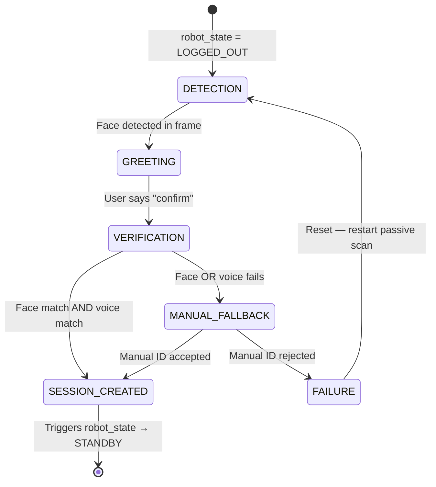
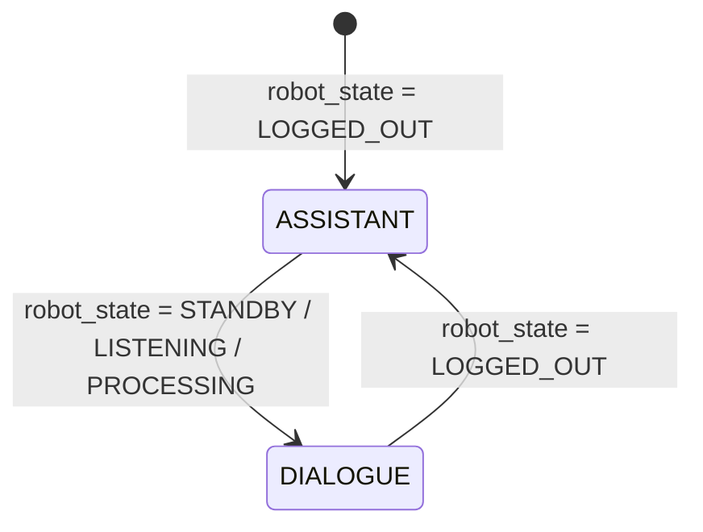
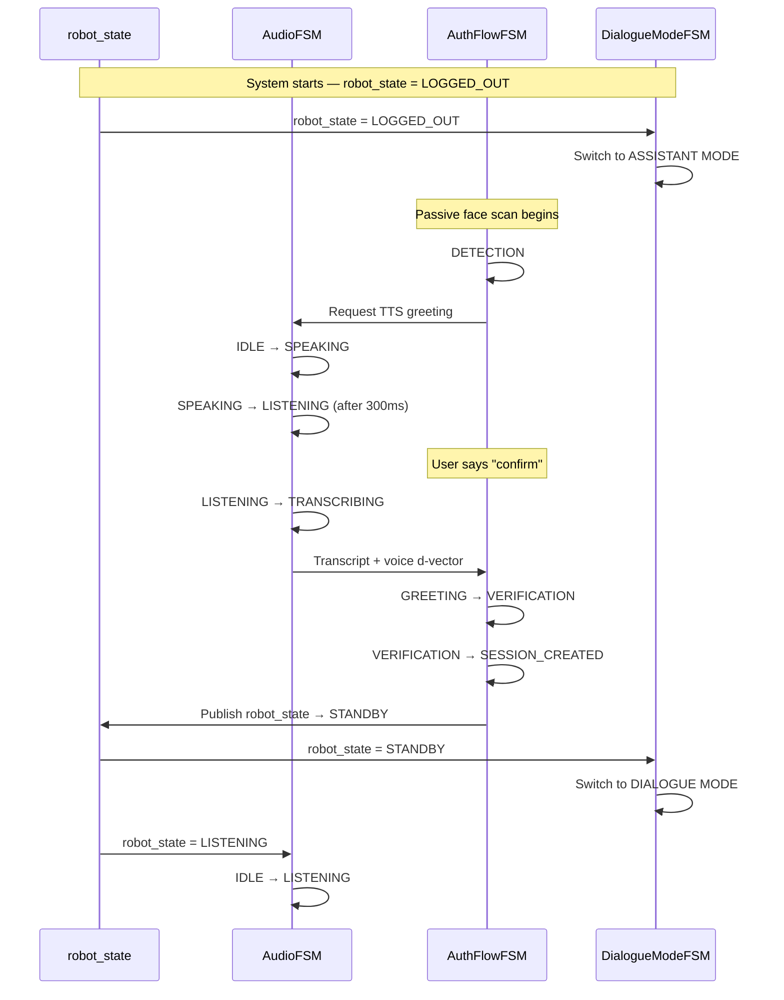

# Voice, Audio & Auth Flow State Machines

## Overview

This document covers the three state machines that govern all voice interaction and authentication in the ACARE system:

1. **Audio State Machine** (`voice_node`) — microphone, VAD, TTS, and Deepgram WebSocket lifecycle
2. **Auth Flow State Machine** (`auth_node` + `dialogue_node`) — scripted biometric login flow
3. **Dialogue Mode State Machine** (`dialogue_node`) — mode switching between assistant and dialogue

These three machines work in concert: the auth flow uses the audio machine to capture voice during login, and the dialogue mode machine determines how the dialogue node behaves once the user is authenticated.

---

## Implementation Status

> This section tracks what is actually built vs what is designed. Updated as of April 2026.

| Component | Status | Notes |
|-----------|--------|-------|
| `VADListener` (Silero, 32ms chunks) | ✅ Built | `voice/vad.py` — streaming + pause/resume |
| `ASRClient` (Deepgram Nova-2) | ✅ Built | `voice/asr.py` — WebSocket, keepalive, dedup |
| `KeywordMonitor` (ESTOP_LISTEN) | ✅ Built | `voice/keyword_monitor.py` — partial-based, 100ms collision window |
| `TTS` (edge-tts + pyttsx3 fallback) | ✅ Built | `voice/tts.py` — URGENT/NORMAL priority, 300ms buffer |
| `AudioStateMachine` (enum + transitions) | ✅ Built | `voice/voice_node.py` — `AudioState` enum, wired in `VoiceNode` |
| `Normaliser` + `AliasExpansion` | ✅ Built | `voice/normaliser.py`, `voice/alias_expansion.py` |
| `IntentParser` (Groq) | ✅ Built | `voice/intent_parser.py` — JSON structured output |
| `AssistantAgent` (Groq, LOGGED_OUT) | ✅ Built | `voice/assistant_agent.py` — bounded to ACARE intro + auth guidance |
| `DialogueModeStateMachine` | ⚠️ Partial | Mode switching logic exists in `VoiceNode` but not a formal class yet |
| `AuthFlowStateMachine` | ❌ Not built | `auth_node` is a separate package — **camera side, not yet integrated** |
| Face detection / embedding | ❌ Not built | Camera is with the other team member — integration pending |
| Voice d-vector extraction | ❌ Not built | SpeechBrain speaker verification — stub only |
| Session management (ROS2) | ❌ Stub | `on_logged_in()` / `on_logged_out()` exist in `VoiceNode` but not wired to `auth_node` |

---

## Split-Team Integration Note

> **The auth flow is dual biometric (face + voice), but the two halves are currently developed separately.**

- **Voice side (this repo)**: microphone, VAD, ASR, keyword monitor, TTS, intent parsing, assistant agent — all in `acarevoice/voice/`
- **Camera side (other team member)**: YDLIDAR HP60C wrist camera, face detection, face embedding extraction, `auth_node` — separate codebase

### What needs to happen at integration time

```
Camera side                          Voice side
──────────────────────────────────   ──────────────────────────────────
auth_node detects face               voice_node is in IDLE / LOGGED_OUT
  → extracts face embedding            → AssistantAgent active
  → publishes /auth_request            
                                     voice_node receives /auth_request
                                       → TTS: "Hello, please say confirm"
                                       → transitions AudioState → LISTENING
                                     
user says "confirm"                  
  → VAD captures utterance           
  → Deepgram transcribes             
  → voice_node extracts d-vector     
  → publishes voice embedding        
                                     
auth_node receives voice embedding   
  → runs dual biometric check        
  → face match + voice match         
  → publishes /auth_result           
                                     
                                     voice_node receives /auth_result
                                       → calls on_logged_in(user_id, name)
                                       → robot_state → STANDBY
```

### Integration contract (ROS2 topics)

| Topic | Type | Direction | Status |
|-------|------|-----------|--------|
| `/auth_request` | `AuthRequest` | `auth_node` → `voice_node` | ❌ Not wired |
| `/voice_embedding` | `float32[]` | `voice_node` → `auth_node` | ❌ Not wired |
| `/auth_result` | `AuthResult` | `auth_node` → `voice_node` | ❌ Not wired |
| `/robot_state` | `RobotState` | `state_manager` → all | ❌ Not wired (standalone only) |
| `/state_transition` | `StateTransition` | `voice_node` → `state_manager` | ❌ Not wired |

### What voice_node already provides for integration

`VoiceNode` has stub hooks ready to be wired:

```python
node.on_logged_in(user_id="staff_001", name="Dr. Sharma")  # call from auth_node on success
node.on_logged_out()                                         # call from auth_node on logout
node.on_resume()                                             # call after ESTOP cleared
```

These are already implemented and tested in standalone mode. They just need to be called from ROS2 subscribers instead of the CLI.

### Missing piece on voice side for auth

The voice side needs to add **d-vector extraction** from the "confirm" utterance. SpeechBrain `EncoderClassifier` is the planned library. The flow:

```python
# When user says "confirm" during auth flow:
audio_np = vad_flush_buffer          # captured by VADListener
embedding = speaker_model.encode(audio_np)   # SpeechBrain d-vector
# publish embedding → auth_node for comparison against enrolled d-vector
```

This is not yet implemented. It's a ~30-line addition to `voice_node.py` once the auth integration sprint starts.

---

## 1. Audio State Machine

> ✅ Fully implemented in `voice/voice_node.py` (`AudioState` enum + `VoiceNode` class)

### States

| State | Description |
|-------|-------------|
| `IDLE` | Mic muted, no audio processing, WebSocket closed |
| `LISTENING` | Mic active, VAD running, Deepgram WebSocket open |
| `TRANSCRIBING` | VAD detected utterance end, audio buffer sent to Deepgram |
| `SPEAKING` | TTS playing, mic hard-muted |
| `ESTOP_LISTEN` | Parallel thread — always active regardless of main state |

### State Diagram

```mermaid
stateDiagram-v2
    [*] --> IDLE: voice_node startup

    IDLE --> LISTENING: robot_state = LISTENING
    LISTENING --> TRANSCRIBING: VAD detects utterance end
    TRANSCRIBING --> SPEAKING: TTS response queued
    SPEAKING --> LISTENING: TTS complete + 300ms buffer

    LISTENING --> IDLE: robot_state != LISTENING
    TRANSCRIBING --> IDLE: robot_state != LISTENING
    SPEAKING --> IDLE: robot_state != LISTENING

    note right of ESTOP_LISTEN
        Parallel thread — always running
        Monitors for "emergency stop" keyword
        Triggers ESTOP regardless of main state
    end note
```

### Transition Rules

| From | To | Trigger | Actions |
|------|----|---------|---------|
| `IDLE` | `LISTENING` | `robot_state = LISTENING` | Unmute mic, open Deepgram WebSocket, activate VAD |
| `LISTENING` | `TRANSCRIBING` | VAD detects silence after speech | Send audio buffer to Deepgram for transcription |
| `TRANSCRIBING` | `SPEAKING` | TTS response ready | Mute mic, enqueue TTS, begin playback |
| `SPEAKING` | `LISTENING` | TTS playback complete | Wait 300ms, unmute mic, resume VAD |
| Any | `IDLE` | `robot_state != LISTENING` | Mute mic, close WebSocket, stop all audio |

### Data Model

```python
@dataclass
class AudioState:
    state: str          # IDLE | LISTENING | TRANSCRIBING | SPEAKING | ESTOP_LISTEN
    mic_muted: bool
    tts_active: bool
    websocket_open: bool
    timestamp: int      # Unix milliseconds
```

**Invariants**:
- `mic_muted` must be `True` when `state == SPEAKING`
- `websocket_open` must be `True` when `state in (LISTENING, TRANSCRIBING)`
- `ESTOP_LISTEN` is parallel — not mutually exclusive with the main state

### Interface

```python
class AudioStateMachine:
    def transition_to_listening(self) -> None:
        """Unmute mic, activate VAD, open Deepgram WebSocket."""

    def transition_to_transcribing(self) -> None:
        """VAD detected utterance end — send buffer to Deepgram."""

    def transition_to_speaking(self, text: str, priority: str) -> None:
        """
        Mute mic, play TTS.
        priority: NORMAL (append to queue) | URGENT (hard-cut + clear queue)
        """

    def transition_to_idle(self) -> None:
        """Mute mic, close WebSocket, stop all audio."""

    def get_current_state(self) -> str: ...
    def is_mic_muted(self) -> bool: ...
```

### Special Behaviors

**ESTOP_LISTEN (Parallel Thread)**
- Runs independently of the main audio state
- Monitors raw audio for the keyword "emergency stop"
- On detection: immediately publishes `SafetyAlert(severity=ESTOP, source=voice)`
- Cannot be muted or disabled — survives all state transitions

**TTS Priority Queue**
- `NORMAL` messages append to the playback queue
- `URGENT` messages hard-cut the current TTS, clear the queue, and play immediately
- Used for safety announcements and ESTOP confirmations

**300ms Echo Buffer**
- After TTS playback ends, mic stays muted for 300ms
- Prevents residual speaker echo from triggering VAD
- Timer resets if another TTS message starts playing

**Deepgram WebSocket Lifecycle**
- WebSocket opens on transition to `LISTENING`
- Stays open through `TRANSCRIBING` (streaming continues)
- Closes on transition to `IDLE` or `SPEAKING`
- Reconnects automatically if connection drops while in `LISTENING`

---

## 2. Auth Flow State Machine

> ❌ Not yet built. `auth_node` is the camera team's responsibility. Voice side provides the d-vector extraction hook and the `on_logged_in` / `on_logged_out` callbacks. Integration sprint required.

### States

| State | Description |
|-------|-------------|
| `DETECTION` | Passive face scan running, waiting for a face to appear |
| `GREETING` | Face detected — robot delivers scripted greeting |
| `VERIFICATION` | Dual biometric check in progress (face + voice d-vector) |
| `MANUAL_FALLBACK` | Auto-verification failed — asking user to state their name |
| `SESSION_CREATED` | Verification passed — session created, robot transitions to STANDBY |
| `FAILURE` | All verification paths exhausted — flow resets |

### State Diagram



### Transition Rules

| From | To | Trigger | Actions |
|------|----|---------|---------|
| `DETECTION` | `GREETING` | Face detected in camera frame | Extract face embedding, TTS greeting |
| `GREETING` | `VERIFICATION` | "confirm" utterance received | Extract voice d-vector, run dual biometric check |
| `VERIFICATION` | `SESSION_CREATED` | Both face and voice match | Create session, publish `robot_state → STANDBY` |
| `VERIFICATION` | `MANUAL_FALLBACK` | Either face or voice fails | TTS fallback prompt |
| `MANUAL_FALLBACK` | `SESSION_CREATED` | Manual name matches known user | Create session with manual `user_id` |
| `MANUAL_FALLBACK` | `FAILURE` | Name not recognised | Log `UNAUTHORISED_VOICE_ATTEMPT`, TTS rejection |
| `FAILURE` | `DETECTION` | Auto-reset | Clear all embeddings, restart passive scan |

### Scripted Prompts (Fixed — Not Free Conversation)

| State | Robot Says |
|-------|-----------|
| `GREETING` | "Hello! I can see you. Please say confirm to continue." |
| `MANUAL_FALLBACK` | "I couldn't verify you automatically. Please state your full name." |
| `FAILURE` | "I'm sorry, I wasn't able to identify you. Please contact a staff member." |

### Data Model

```python
@dataclass
class AuthFlowState:
    state: str                          # DETECTION | GREETING | VERIFICATION |
                                        # MANUAL_FALLBACK | SESSION_CREATED | FAILURE
    face_embedding: Optional[np.ndarray] = None
    voice_embedding: Optional[np.ndarray] = None
    candidate_user_id: Optional[str] = None
    attempt_count: int = 0
    timestamp: int = 0
```

### Interface

```python
class AuthFlowStateMachine:
    def start_auth_flow(self) -> None:
        """Begin passive face scan from DETECTION state."""

    def handle_detection(self, face_embedding: np.ndarray) -> None:
        """Face detected — store embedding, transition to GREETING."""

    def handle_greeting_response(
        self,
        voice_transcript: str,
        voice_embedding: np.ndarray
    ) -> None:
        """
        User said "confirm" — extract d-vector, kick off dual biometric check.
        Transitions to VERIFICATION.
        """

    def handle_verification_result(
        self,
        face_match: bool,
        voice_match: bool,
        user_id: str
    ) -> None:
        """
        Both passed → SESSION_CREATED.
        Either failed → MANUAL_FALLBACK.
        """

    def handle_manual_fallback(self, user_input: str) -> None:
        """
        Try to match stated name against known users.
        Success → SESSION_CREATED. Failure → FAILURE.
        """

    def handle_failure(self) -> None:
        """Log attempt, clear state, reset to DETECTION."""

    def get_current_state(self) -> str: ...
```

### Verification Logic

**Dual Biometric Check** (both must pass for auto-login):
1. **Face**: Cosine similarity of detected embedding vs stored embedding ≥ threshold
2. **Voice**: Cosine similarity of d-vector vs stored d-vector ≥ threshold

**Manual Fallback** (single factor):
- User states their name verbally
- Transcript matched against `users.db` display names (fuzzy match)
- Logs `MANUAL_AUTH_USED` on success
- Logs `UNAUTHORISED_VOICE_ATTEMPT` on failure

**Failure Logging**:
```python
{
    "event": "UNAUTHORISED_VOICE_ATTEMPT",
    "face_embedding_hash": "<hash>",
    "timestamp": "<unix_ms>",
    "attempt_count": 2
}
```

---

## 3. Dialogue Mode State Machine

> ⚠️ Partially implemented. The mode switching logic exists implicitly in `VoiceNode._on_transcript()` — it checks `robot_state == LOGGED_OUT` to route to `AssistantAgent` vs the command pipeline. A formal `DialogueModeStateMachine` class has not been extracted yet. LangGraph pipeline for DIALOGUE mode is not built.

### States

| State | Active When | Backend |
|-------|-------------|---------|
| `ASSISTANT` | `robot_state = LOGGED_OUT` | Groq LLM — conversational agent |
| `DIALOGUE` | `robot_state ∈ {STANDBY, LISTENING, PROCESSING}` | LangGraph multi-node pipeline |

### State Diagram



### Transition Rules

| From | To | Trigger | Actions |
|------|----|---------|---------|
| `ASSISTANT` | `DIALOGUE` | User authenticated (`robot_state → STANDBY`) | Teardown Groq agent, initialise LangGraph pipeline |
| `DIALOGUE` | `ASSISTANT` | User logged out (`robot_state → LOGGED_OUT`) | Teardown LangGraph pipeline, initialise Groq agent |

### Mode Behaviors

**ASSISTANT MODE**
- Groq-powered free conversation
- Scope: ACARE introduction, capability overview, auth guidance
- Cannot execute robot commands — no access to planner or motion
- Stays active until user successfully authenticates

**DIALOGUE MODE**
- LangGraph multi-node graph
- Handles: intent parsing, clarification, command routing, task planning
- Has access to planner_node for motion commands
- Transitions back to ASSISTANT on logout

### Interface

```python
class DialogueModeStateMachine:
    def update_mode(self, robot_state: str) -> None:
        """
        Called on every /robot_state update.
        Switches mode if robot_state crosses the LOGGED_OUT boundary.
        """

    def get_current_mode(self) -> str:
        """Returns 'ASSISTANT' or 'DIALOGUE'."""

    def is_assistant_mode(self) -> bool: ...
    def is_dialogue_mode(self) -> bool: ...
```

---

## Interaction Between the Three Machines



---

## ROS2 Topics & Services

| Topic / Service | Direction | Used By |
|-----------------|-----------|---------|
| `/robot_state` | Subscribe | AudioFSM, DialogueModeFSM |
| `/state_transition` | Publish | AuthFlowFSM (on SESSION_CREATED) |
| `/safety_alert` | Publish | AudioFSM (ESTOP_LISTEN thread) |
| `/tts_request` | Subscribe | AudioFSM (SPEAKING trigger) |
| `/asr_transcript` | Publish | AudioFSM (after TRANSCRIBING) |
| `/auth_event` | Publish | AuthFlowFSM (login/failure events) |
| `/dialogue_mode` | Publish | DialogueModeFSM (mode change events) |

---

## Known Gaps & Open Items

### 1. D-vector extraction not implemented
The voice side needs to extract a speaker embedding from the "confirm" utterance during auth. SpeechBrain `EncoderClassifier` is the planned approach. Blocked until auth integration sprint.

### 2. `DialogueModeStateMachine` not a formal class
The mode switching is inline in `VoiceNode._on_transcript()`. Should be extracted into a proper class when `dialogue_node` is built as a separate ROS2 node.

### 3. LangGraph DIALOGUE pipeline not built
`dialogue_node` with LangGraph multi-node intent graph is not yet implemented. Currently `voice_node` handles intent parsing directly via Groq + `intent_parser.py`. This will need to be split out.

### 4. ROS2 wiring not done
`VoiceNode` runs standalone. All ROS2 pub/sub wiring (`/robot_state`, `/auth_result`, `/state_transition`, etc.) is stubbed. The `on_logged_in` / `on_logged_out` / `on_resume` hooks are ready — they just need to be called from ROS2 subscribers.

### 5. TTS priority queue is not a queue
Currently `speak()` in `tts.py` is blocking — it plays one utterance and returns. There's no actual queue. URGENT uses `pyttsx3` (faster, local), NORMAL uses `edge-tts`. A proper async queue with hard-cut support needs to be built when the full ROS2 node is assembled.

### 6. Deepgram keepalive sends silence during TTS
The current approach sends 512-sample silence packets every 1s to keep the WebSocket alive during TTS. This works but means Deepgram is always receiving audio even when the mic is "muted". The VAD `pause_streaming()` stops sending real mic audio, but the keepalive thread continues. This is intentional — prevents the 15s timeout — but worth documenting.

---

## TODO: Implementation Tasks for Voice Team

> **Assignee**: Voice/microphone team member  
> **Target**: ROS2 Jazzy conversion + auth integration + missing features  
> **Priority**: High — blocking full system integration

### Task 1: Add D-vector Extraction (SpeechBrain)

**File**: `acarevoice/voice/voice_node.py`

**What to add**:
```python
# At top of file
from speechbrain.pretrained import EncoderClassifier

class VoiceNode:
    def __init__(self, ...):
        # ... existing init ...
        
        # Add speaker verification model
        self.speaker_model = EncoderClassifier.from_hparams(
            source="speechbrain/spkrec-ecapa-voxceleb",
            savedir="models/speaker_verification"
        )
    
    def extract_voice_embedding(self, audio_np: np.ndarray) -> np.ndarray:
        """
        Extract d-vector from audio for voice verification.
        
        Args:
            audio_np: Audio buffer (float32, 16kHz)
            
        Returns:
            192-dim d-vector embedding
        """
        import torch
        audio_tensor = torch.FloatTensor(audio_np).unsqueeze(0)
        with torch.no_grad():
            embedding = self.speaker_model.encode_batch(audio_tensor)
        return embedding.squeeze().cpu().numpy()
```

**When to call it**:
- During auth flow when user says "confirm"
- Publish the embedding to `/voice_embedding` topic for `auth_node` to verify

**Dependencies**:
```bash
pip install speechbrain torch torchaudio
```

**Test**:
```python
# Standalone test
audio = np.random.randn(16000 * 2)  # 2 seconds of audio
embedding = node.extract_voice_embedding(audio)
print(f"Embedding shape: {embedding.shape}")  # Should be (192,)
```

---

### Task 2: Convert to ROS2 Jazzy Node

**New file**: `acarevoice/voice/voice_node_ros2.py`

**What to build**:
```python
import rclpy
from rclpy.node import Node
from std_msgs.msg import String
from acare_msgs.msg import (
    RobotState, StateTransition, SafetyAlert,
    AuthRequest, AuthResult, Transcript
)
import numpy as np
from .voice_node import VoiceNode, AudioState, RobotState as RobotStateEnum

class VoiceNodeROS2(Node):
    def __init__(self):
        super().__init__('voice_node')
        
        # Wrap the standalone VoiceNode
        self.voice_node = VoiceNode(
            on_intent_resolved=self._publish_intent,
            on_estop_triggered=self._publish_estop,
            on_transcript=self._publish_transcript
        )
        
        # Publishers
        self.pub_transcript = self.create_publisher(Transcript, '/asr_transcript', 10)
        self.pub_intent = self.create_publisher(String, '/validated_intent', 10)  # TODO: use ValidatedIntent msg
        self.pub_safety = self.create_publisher(SafetyAlert, '/safety_alert', 10)
        self.pub_state_transition = self.create_publisher(StateTransition, '/state_transition', 10)
        self.pub_voice_embedding = self.create_publisher(String, '/voice_embedding', 10)  # TODO: use Float32MultiArray
        
        # Subscribers
        self.sub_robot_state = self.create_subscription(
            RobotState, '/robot_state', self._on_robot_state, 10
        )
        self.sub_auth_request = self.create_subscription(
            AuthRequest, '/auth_request', self._on_auth_request, 10
        )
        self.sub_auth_result = self.create_subscription(
            AuthResult, '/auth_result', self._on_auth_result, 10
        )
        self.sub_tts_request = self.create_subscription(
            String, '/tts_request', self._on_tts_request, 10
        )
        
        # Start voice pipeline
        self.voice_node.start()
        self.get_logger().info("Voice node started")
    
    def _on_robot_state(self, msg: RobotState):
        """Update internal robot state when state_manager publishes."""
        # Map ROS2 msg to internal enum
        state_map = {
            'LOGGED_OUT': RobotStateEnum.LOGGED_OUT,
            'STANDBY': RobotStateEnum.STANDBY,
            'LISTENING': RobotStateEnum.LISTENING,
            'PROCESSING': RobotStateEnum.PROCESSING,
            'EXECUTING': RobotStateEnum.EXECUTING,
            'HOLDING': RobotStateEnum.HOLDING,
            'HANDOVER': RobotStateEnum.HANDOVER,
            'ESTOP': RobotStateEnum.ESTOP,
        }
        self.voice_node.robot_state = state_map.get(msg.state, RobotStateEnum.LOGGED_OUT)
        self.get_logger().info(f"Robot state updated: {msg.state}")
    
    def _on_auth_request(self, msg: AuthRequest):
        """
        Auth node detected face, requesting voice confirmation.
        Trigger TTS greeting and wait for 'confirm' utterance.
        """
        from .tts import speak
        speak("Hello, please say confirm to continue.", self.voice_node.vad)
        self.voice_node.audio_state = AudioState.LISTENING
        self.get_logger().info("Auth request received, waiting for 'confirm'")
        
        # TODO: Set a flag so next transcript triggers d-vector extraction
        self.voice_node._auth_flow_active = True
    
    def _on_auth_result(self, msg: AuthResult):
        """Auth node completed verification, update session."""
        if msg.success:
            self.voice_node.on_logged_in(msg.user_id, msg.name)
            self.get_logger().info(f"Login successful: {msg.name}")
        else:
            from .tts import speak
            speak("Authentication failed. Please try again.", self.voice_node.vad)
            self.get_logger().warn("Authentication failed")
    
    def _on_tts_request(self, msg: String):
        """External TTS request (from planner_node, dialogue_node, etc.)."""
        from .tts import speak
        speak(msg.data, self.voice_node.vad)
    
    def _publish_transcript(self, text: str):
        """Publish final transcript to /asr_transcript."""
        msg = Transcript()
        msg.text = text
        msg.timestamp = self.get_clock().now().nanoseconds // 1_000_000
        self.pub_transcript.publish(msg)
        
        # If auth flow active, extract d-vector and publish
        if getattr(self.voice_node, '_auth_flow_active', False):
            if 'confirm' in text.lower():
                # Extract d-vector from last VAD buffer
                # TODO: Store VAD buffer in voice_node for this purpose
                embedding = self.voice_node.extract_voice_embedding(self.voice_node._last_audio_buffer)
                # TODO: Publish embedding to /voice_embedding
                self.voice_node._auth_flow_active = False
                self.get_logger().info("Voice embedding extracted and published")
    
    def _publish_intent(self, intent: dict):
        """Publish validated intent to /validated_intent."""
        # TODO: Use proper ValidatedIntent message type
        msg = String()
        msg.data = str(intent)
        self.pub_intent.publish(msg)
        self.get_logger().info(f"Intent published: {intent['tool']}")
    
    def _publish_estop(self, keyword: str):
        """Publish ESTOP safety alert."""
        msg = SafetyAlert()
        msg.reason = f"Emergency keyword detected: {keyword}"
        msg.source = "voice"
        msg.severity = "ESTOP"
        msg.timestamp = self.get_clock().now().nanoseconds // 1_000_000
        self.pub_safety.publish(msg)
        self.get_logger().error(f"ESTOP triggered: {keyword}")
    
    def destroy_node(self):
        """Cleanup on shutdown."""
        self.voice_node.stop()
        super().destroy_node()


def main(args=None):
    rclpy.init(args=args)
    node = VoiceNodeROS2()
    try:
        rclpy.spin(node)
    except KeyboardInterrupt:
        pass
    finally:
        node.destroy_node()
        rclpy.shutdown()


if __name__ == '__main__':
    main()
```

**Package setup** (`setup.py`):
```python
from setuptools import setup

package_name = 'acare_voice'

setup(
    name=package_name,
    version='0.1.0',
    packages=[package_name],
    install_requires=['setuptools'],
    zip_safe=True,
    maintainer='ACARE Team',
    maintainer_email='team@acare.com',
    description='ACARE Voice Node - Audio pipeline for ROS2 Jazzy',
    license='MIT',
    tests_require=['pytest'],
    entry_points={
        'console_scripts': [
            'voice_node = acare_voice.voice_node_ros2:main',
        ],
    },
)
```

**Test**:
```bash
# Build
cd ~/acare_ws
colcon build --packages-select acare_voice

# Run
source install/setup.bash
ros2 run acare_voice voice_node
```

---

### Task 3: Build TTS Priority Queue with Hard-Cut

**File**: `acarevoice/voice/tts.py`

**What to add**:
```python
import queue
import threading

class TTSQueue:
    """
    Priority queue for TTS with URGENT hard-cut support.
    URGENT messages clear queue and interrupt current playback.
    """
    def __init__(self, vad_listener=None):
        self.queue = queue.PriorityQueue()
        self.vad_listener = vad_listener
        self.current_thread = None
        self.stop_current = threading.Event()
        self.worker_thread = threading.Thread(target=self._worker, daemon=True)
        self.worker_thread.start()
    
    def enqueue(self, text: str, priority: Priority = Priority.NORMAL):
        """Add TTS message to queue."""
        self.queue.put((priority.value, text))
        
        if priority == Priority.URGENT:
            # Hard-cut current playback
            self.stop_current.set()
            # Clear queue
            while not self.queue.empty():
                try:
                    self.queue.get_nowait()
                except queue.Empty:
                    break
            # Re-add urgent message
            self.queue.put((priority.value, text))
    
    def _worker(self):
        """Background worker that processes TTS queue."""
        while True:
            priority, text = self.queue.get()
            self.stop_current.clear()
            
            # Mute mic
            if self.vad_listener:
                self.vad_listener.pause_streaming()
            
            # Play TTS (check stop_current flag during playback)
            self._play_interruptible(text, priority)
            
            # 300ms buffer
            time.sleep(0.3)
            
            # Unmute mic
            if self.vad_listener:
                self.vad_listener.resume_streaming()
            
            self.queue.task_done()
    
    def _play_interruptible(self, text: str, priority: int):
        """Play TTS with interrupt support."""
        # TODO: Implement chunk-based playback that checks stop_current
        # For now, just call existing speak functions
        if priority == Priority.URGENT.value:
            _speak_pyttsx3(text)
        else:
            _speak_edge_tts(text)

# Global queue instance
_tts_queue = None

def init_tts_queue(vad_listener=None):
    global _tts_queue
    _tts_queue = TTSQueue(vad_listener)

def speak(text: str, vad_listener=None, priority: Priority = Priority.NORMAL):
    """Enqueue TTS message (non-blocking)."""
    if _tts_queue is None:
        init_tts_queue(vad_listener)
    _tts_queue.enqueue(text, priority)
```

**Update `VoiceNode.__init__`**:
```python
from .tts import init_tts_queue

def __init__(self, ...):
    # ... existing init ...
    init_tts_queue(self.vad)  # Initialize queue with VAD reference
```

---

### Task 4: Extract `DialogueModeStateMachine` Class

**New file**: `acarevoice/voice/dialogue_mode_fsm.py`

**What to build**:
```python
from enum import Enum
from typing import Callable, Optional

class DialogueMode(Enum):
    ASSISTANT = "ASSISTANT"  # LOGGED_OUT - Groq conversational agent
    DIALOGUE = "DIALOGUE"    # Authenticated - LangGraph intent pipeline

class DialogueModeStateMachine:
    """
    Manages dialogue node operating mode based on robot state.
    ASSISTANT mode: Groq agent for ACARE intro + auth guidance.
    DIALOGUE mode: LangGraph multi-node intent graph.
    """
    def __init__(
        self,
        on_mode_change: Optional[Callable[[DialogueMode], None]] = None
    ):
        self.current_mode = DialogueMode.ASSISTANT
        self.on_mode_change_cb = on_mode_change
    
    def update_from_robot_state(self, robot_state: str) -> None:
        """
        Update mode based on global robot state.
        
        Args:
            robot_state: Current robot state (LOGGED_OUT, STANDBY, etc.)
        """
        if robot_state == "LOGGED_OUT":
            self._transition_to(DialogueMode.ASSISTANT)
        elif robot_state in ("STANDBY", "LISTENING", "PROCESSING"):
            self._transition_to(DialogueMode.DIALOGUE)
    
    def _transition_to(self, new_mode: DialogueMode) -> None:
        """Internal transition with callback."""
        if new_mode == self.current_mode:
            return
        
        old_mode = self.current_mode
        self.current_mode = new_mode
        
        print(f"[DialogueMode] {old_mode.value} → {new_mode.value}")
        
        if self.on_mode_change_cb:
            self.on_mode_change_cb(new_mode)
    
    def is_assistant_mode(self) -> bool:
        return self.current_mode == DialogueMode.ASSISTANT
    
    def is_dialogue_mode(self) -> bool:
        return self.current_mode == DialogueMode.DIALOGUE
    
    def get_current_mode(self) -> DialogueMode:
        return self.current_mode
```

**Update `VoiceNode`**:
```python
from .dialogue_mode_fsm import DialogueModeStateMachine, DialogueMode

class VoiceNode:
    def __init__(self, ...):
        # ... existing init ...
        self.dialogue_mode_fsm = DialogueModeStateMachine(
            on_mode_change=self._on_dialogue_mode_change
        )
    
    def _on_dialogue_mode_change(self, new_mode: DialogueMode):
        """Called when dialogue mode changes."""
        if new_mode == DialogueMode.ASSISTANT:
            self.assistant.reset_conversation()
        # TODO: Initialize LangGraph pipeline when DIALOGUE mode
    
    def _on_transcript(self, text: str):
        # ... existing code ...
        
        # Update dialogue mode based on robot state
        self.dialogue_mode_fsm.update_from_robot_state(self.robot_state.value)
        
        # Route based on mode
        if self.dialogue_mode_fsm.is_assistant_mode():
            response = self.assistant.get_response(text)
            speak(response, self.vad)
            return
        
        # DIALOGUE mode - full command pipeline
        self._process_command(text)
```

---

### Task 5: Store VAD Buffer for D-vector Extraction

**File**: `acarevoice/voice/vad.py`

**What to add**:
```python
class VADListener:
    def __init__(self, asr_client=None):
        # ... existing init ...
        self.last_utterance_buffer = None  # Store last complete utterance
    
    def _flush(self):
        if self.speech_buffer and self.callback:
            audio = np.concatenate(self.speech_buffer)
            self.last_utterance_buffer = audio  # Store for d-vector extraction
            self.callback(audio)
        self._reset()
    
    def get_last_utterance(self) -> Optional[np.ndarray]:
        """Get the last complete utterance buffer."""
        return self.last_utterance_buffer
```

**Update `VoiceNode`**:
```python
def _publish_transcript(self, text: str):
    # ... existing code ...
    
    # If auth flow active, extract d-vector
    if getattr(self, '_auth_flow_active', False):
        if 'confirm' in text.lower():
            audio_buffer = self.vad.get_last_utterance()
            if audio_buffer is not None:
                embedding = self.extract_voice_embedding(audio_buffer)
                # Publish to /voice_embedding
                self._auth_flow_active = False
```

---

### Task 6: Create ROS2 Message Definitions

**New package**: `acare_msgs`

**File structure**:
```
acare_msgs/
├── msg/
│   ├── RobotState.msg
│   ├── StateTransition.msg
│   ├── SafetyAlert.msg
│   ├── AuthRequest.msg
│   ├── AuthResult.msg
│   ├── Transcript.msg
│   ├── ValidatedIntent.msg
│   └── VoiceEmbedding.msg
├── CMakeLists.txt
└── package.xml
```

**Example**: `msg/Transcript.msg`
```
string text
int64 timestamp
```

**Example**: `msg/VoiceEmbedding.msg`
```
float32[] embedding  # 192-dim d-vector
int64 timestamp
string context       # "auth_confirm" or "runtime_verification"
```

**Example**: `msg/AuthRequest.msg`
```
string request_type  # "face_detected" or "manual_fallback"
int64 timestamp
```

**Example**: `msg/AuthResult.msg`
```
bool success
string user_id
string name
string role
bool face_verified
bool voice_verified
float32 face_confidence
float32 voice_confidence
int64 timestamp
```

**Build**:
```bash
cd ~/acare_ws
colcon build --packages-select acare_msgs
source install/setup.bash
```

---

### Task 7: Integration Testing Checklist

Once all tasks above are complete, test the full pipeline:

- [ ] **Standalone voice_node still works** (run `python -m acarevoice.voice.voice_node`)
- [ ] **ROS2 node launches** (`ros2 run acare_voice voice_node`)
- [ ] **Subscribes to `/robot_state`** (check with `ros2 topic echo /robot_state`)
- [ ] **Publishes `/asr_transcript`** (speak into mic, check topic)
- [ ] **ESTOP keyword triggers `/safety_alert`** (say "stop", check topic)
- [ ] **D-vector extraction works** (mock auth flow, check embedding shape)
- [ ] **TTS queue handles URGENT hard-cut** (queue 3 NORMAL, send 1 URGENT, verify interrupt)
- [ ] **Dialogue mode switches on login** (mock login, verify mode change log)
- [ ] **Auth flow integration** (with camera team's `auth_node`, full dual biometric test)

---

## Summary for Voice Team

**What you have**:
- Solid standalone voice pipeline (VAD, ASR, TTS, keyword monitor, intent parsing)
- Clean architecture with `VoiceNode` orchestrating everything
- Hooks ready for ROS2 integration (`on_logged_in`, `on_logged_out`, `on_resume`)

**What you need to build**:
1. D-vector extraction (SpeechBrain) — ~50 lines
2. ROS2 Jazzy wrapper node — ~200 lines
3. TTS priority queue with hard-cut — ~100 lines
4. Extract `DialogueModeStateMachine` class — ~80 lines
5. Store VAD buffer for d-vector — ~10 lines
6. ROS2 message definitions — 8 `.msg` files
7. Integration testing with camera team's `auth_node`

**Estimated effort**: 2-3 days for experienced ROS2 developer

**Blockers**: None — all tasks can be done independently. Auth integration testing requires camera team's `auth_node` to be ready.

---

## Error Handling

| Scenario | Machine | Response |
|----------|---------|----------|
| Deepgram WebSocket drops | AudioFSM | Reconnect with exponential backoff; stay in LISTENING |
| TTS engine fails | AudioFSM | Log error, skip utterance, return to LISTENING |
| Face detection timeout (>10s) | AuthFlowFSM | Stay in DETECTION, log timeout |
| Voice d-vector extraction fails | AuthFlowFSM | Treat as voice mismatch, go to MANUAL_FALLBACK |
| "emergency stop" keyword | AudioFSM (ESTOP_LISTEN) | Publish ESTOP SafetyAlert immediately |
| Groq API unavailable | DialogueModeFSM | Respond with canned offline message |
| LangGraph pipeline error | DialogueModeFSM | Log error, TTS "I had trouble with that, please try again" |
