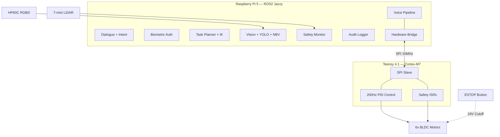
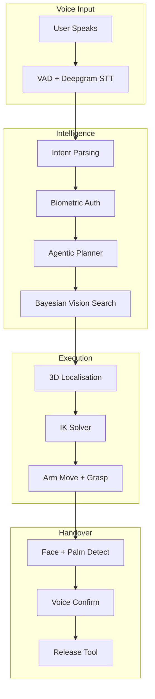
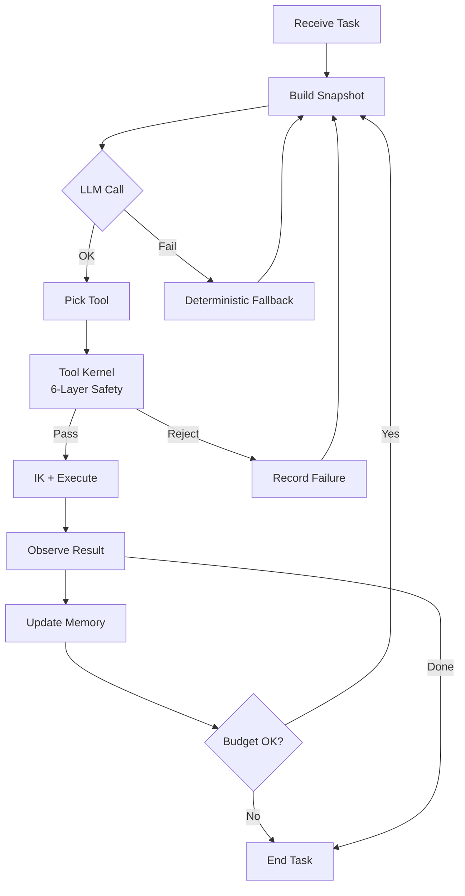

# ACARE — Autonomous Clinical Assistance Robot with Multimodal Biometric Authentication and Dynamic Human Handover

<p align="center">
  
  
  
 
</p>

---

## Table of Contents

1. [Overview](#overview)
2. [What Makes ACARE Different](#what-makes-acare-different)
3. [System Architecture](#system-architecture)
4. [Hardware Architecture](#hardware-architecture)
5. [Software Packages](#software-packages)
6. [ROS2 Topic Map](#ros2-topic-map)
7. [State Machine](#state-machine)
8. [Prerequisites](#prerequisites)
9. [Installation](#installation)
10. [Configuration](#configuration)
11. [Running the System](#running-the-system)
12. [Usage Examples](#usage-examples)
13. [LLM Model Allocation](#llm-model-allocation)
14. [Safety Architecture](#safety-architecture)
15. [SPI Communication Protocol](#spi-communication-protocol)
16. [Troubleshooting](#troubleshooting)
17. [Project Structure](#project-structure)
18. [Contributing](#contributing)
19. [License](#license)

---

## Overview

ACARE is a stationary **6-DOF semi-autonomous robotic arm** designed for clinical environments — specifically plastic surgery departments — where surgical tools must be fetched and delivered to authorised staff repeatedly across long procedure shifts. The robot replaces the manual, hygiene-risk-bearing task of instrument handling by providing a **voice-commanded, biometrically authenticated, autonomous pick-and-place system** with human oversight.

**Institution:** Ramaiah Institute of Technology, Bengaluru  
**Department:** Electronics and Communication Engineering  
**Team:** Sathvik Rao · Sarvesh Bhattacharyya · Shreevanth M · Shreyas S  
**Guide:** Dr. Lakshmi Shrinivasan, Associate Professor  

### Core Problems Solved

- Staff fatigue from repetitive tool retrieval during 10–12-hour surgical shifts
- Hygiene risks from manual handling of sterile instruments
- Procedure delays caused by instrument unavailability or incorrect delivery
- Absence of affordable autonomous assistance solutions in Indian healthcare settings

### Scope

- Stationary pick-and-place operation only (no navigation)
- Contactless operation — entirely voice commanded, no physical input required
- Dual biometric authentication — voice and face combined for every session
- Single active user session at any time — one command per turn
- Single tool per command — multi-tool requests handled via clarification dialogue
- Next-Best-View intelligent search — not continuous scanning
- Direct handover — tool delivered from gripper directly into authenticated staff's hand

---

## What Makes ACARE Different

Unlike prior art such as **MOXI**, **TIAGo**, **TUG**, or **LIO**, ACARE integrates several advanced subsystems into a single cohesive platform:

| Feature | ACARE | Prior Art |
|---------|-------|-----------|
| Multimodal biometric auth (voice + face) | ✅ Required for every command | ❌ Rare or absent |
| Voice-driven instrument retrieval with structured intent parsing | ✅ Groq/NIM LLM intent extraction | ❌ GUI or manual control |
| Agentic LLM task planner with triple fallback | ✅ NIM → Groq → deterministic | ❌ Hardcoded state machines |
| Bayesian probabilistic vision search | ✅ Persistent probability map, NBV | ❌ Exhaustive scanning |
| Dynamic human-robot handover with palm tracking | ✅ 3-gate protocol (face+palm+voice) | ❌ Fixed handover positions |
| Layered safety (software + firmware independent) | ✅ Dual-layer ESTOP | ❌ Single-layer safety |
| Analytical IK solver (no iterative methods) | ✅ Deterministic, 0.0000m round-trip | ❌ Numerical/optimisation-based |
| Wrist-mounted RGBD camera with dynamic FK | ✅ Per-pose camera transform | ❌ Fixed table-mounted cameras |
| Sub-200ms ESTOP keyword detection | ✅ Dedicated thread, 100ms debounce | ❌ Integrated into main loop |

---

## System Architecture

ACARE is a **two-layer hierarchical robotic system**:



### High-Level Data Flow

**Scenario:** Surgeon says *"fetch scissors"* → tool delivered to authenticated staff's hand.



### Agentic Planner Loop

The `AgenticPlanner` drives task execution via an LLM-in-the-loop with triple fallback and 6-layer safety validation.



**11 tools available:** `vision_scan`, `arm_move`, `arm_approach`, `gripper_close`, `gripper_open`, `detect_face`, `detect_hand`, `speak`, `ask_user`, `complete_task`, `abort_task`

**Key design decisions:**
- **No conversation history** — each LLM call gets exactly 2 messages (system prompt + current snapshot), not a growing chat log
- **Bounded context** — action history capped at 3 entries, failed actions compressed to `"vision_scan failed 2 times"`
- **Kernel dedup is the hard guard** — even if the LLM forgets (history evicted), the kernel blocks re-execution of failed actions
- **Triple fallback** — NIM Nemotron-49B → Groq Llama 70B → deterministic hardcoded logic. Robot never stops on API failure
- **ESTOP double-check** — checked before every tool call AND between loop iterations
- **Rejection loop** — rejected tools go back to snapshot (not to deterministic fallback), so LLM sees the failure and re-reasons

---

## Hardware Architecture

| Component | Specification |
|-----------|--------------|
| **Compute (High-Level)** | Raspberry Pi 5 (8GB) — ROS2 Jazzy, Ubuntu 24.04 |
| **Compute (Real-Time)** | Teensy 4.1 (Cortex-M7, 600 MHz) — PID motor control |
| **Arm** | 6-DOF serial manipulator (PETG + Aluminium, 352/400/400/236mm links) |
| **Motors** | BLDC motors with RMCS-3002 drivers (6× dedicated UARTs) |
| **Encoders** | AS5600 magnetic encoders (12-bit, I2C via TCA9548A multiplexer) |
| **Vision Camera** | YDLIDAR HP60C RGBD (640×480, 12.4 Hz, wrist-mounted) |
| **Safety LiDAR** | YDLIDAR T-mini Plus 2D (proximity zones: 600mm caution, 400mm ESTOP) |
| **Audio** | USB sound card + active speaker + microphone |
| **Communication** | SPI bus (10 MHz, 64-byte frames, DMA, full-duplex) |
| **Power** | 24V supply with hardware ESTOP button (direct PWM cutoff) |

### Joint Limits

| Joint | Name | Range (degrees) | Range (radians) |
|-------|------|-----------------|-----------------|
| J1 | Base | ±180° | ±3.14 |
| J2 | Shoulder | ±135° | ±2.36 |
| J3 | Elbow | ±120° | ±2.09 |
| J4 | Wrist 1 | ±180° | ±3.14 |
| J5 | Wrist 2 | ±180° | ±3.14 |
| J6 | Wrist 3 | ±180° | ±3.14 |

---

## Software Packages

| Package | Type | Description |
|---------|------|-------------|
| `acare_msgs` | CMake | 18 message definitions + 1 service. Typed contract between all nodes. |
| `acare_bringup` | Python | Shared infrastructure: paths, QoS profiles, config files, launch file, supervisor. |
| `acare_voice` | Python | Voice pipeline: VAD → ASR (Deepgram) → intent (Groq 8B) → TTS (edge-tts/pyttsx3). ESTOP keyword thread. |
| `acare_dialogue` | Python | ROS2 dialogue node: transcript normalisation, alias expansion, intent parsing, confidence gating (<0.8 → clarification). |
| `acare_auth` | Python | Biometric auth: MediaPipe face scan → InsightFace buffalo_sc (cosine >0.78) → ECAPA-TDNN voice (cosine >0.85) → SQLite storage. |
| `acare_planner` | Python | Task planner: 10-state FSM, agentic planner (NIM→Groq→deterministic), analytical IK, 6-layer safety kernel, Bayesian task memory. |
| `acare_safety` | Python | Safety monitor: LiDAR proximity zones + MCU telemetry → graded SafetyAlert. |
| `acare_vision` | Python | Perception: YOLO26 ONNX inference, Bayesian NBV search, depth→3D localisation, MediaPipe hand tracking, fake object rejection. |
| `acare_logging` | Python | Audit trail: SQLite, batched writes, 200MB auto-rotation. |
| `acare_embedded_interface` | Python | Hardware bridge: translates ROS2 commands to Gazebo (sim) or Teensy SPI (hardware). |
| `acare_admin` | Python | CLI tool: staff enrolment, API key management, calibration routines. |

---

## ROS2 Topic Map

| Topic | Type | QoS | Purpose |
|-------|------|-----|---------|
| `/robot_state` | `RobotState` | RELIABLE + TRANSIENT_LOCAL | FSM state broadcast to all nodes |
| `/state_transition` | `StateTransition` | RELIABLE | Requested state transitions |
| `/safety_alert` | `SafetyAlert` | RELIABLE + TRANSIENT_LOCAL | Graded safety alerts (WARNING/ESTOP) |
| `/emergency_stop` | `EmergencySignal` | RELIABLE | Hard ESTOP signal |
| `/raw_transcript` | `Transcript` | RELIABLE | Speech-to-text output |
| `/intent_result` | `Intent` | RELIABLE | Parsed user intent |
| `/validated_intent` | `ValidatedIntent` | RELIABLE | Auth-verified intent for planner |
| `/tts_request` | `String` | RELIABLE | Text-to-speech requests |
| `/vision_search_request` | `VisionSearchRequest` | RELIABLE | Tool search commands |
| `/vision_result` | `VisionResult` | RELIABLE | Detection + 3D localisation results |
| `/arm_command` | `ArmCommand` | RELIABLE | Joint-level arm commands |
| `/gripper_command` | `GripperCommand` | RELIABLE | Gripper open/close/force |
| `/motion_feedback` | `MotionFeedback` | BEST_EFFORT | Arm/gripper feedback from embedded |
| `/log_event` | `LogEvent` | BEST_EFFORT | Audit trail events |
| `/scan` | `LaserScan` | BEST_EFFORT | 2D LiDAR scan data |

---

## State Machine

The global state machine enforces 10 states with strictly validated transitions. All transitions go through `state_manager` — no node changes state directly.

```
OFFLINE → LOGGED_OUT → STANDBY → LISTENING → PROCESSING → EXECUTING → HOLDING → HANDOVER → STANDBY
```

### Transition Table

| From State | Allowed Transitions |
|------------|-------------------|
| OFFLINE | LOGGED_OUT |
| LOGGED_OUT | STANDBY |
| STANDBY | LISTENING, PROCESSING, LOGGED_OUT |
| LISTENING | PROCESSING, STANDBY |
| PROCESSING | EXECUTING, STANDBY |
| EXECUTING | HOLDING, ESTOP |
| HOLDING | HANDOVER, ESTOP |
| HANDOVER | STANDBY, ESTOP |
| ESTOP | STANDBY |
| ERROR | OFFLINE |

**Safety overrides:** ESTOP and ERROR are reachable from ANY state, bypassing the transition table.

**Logout guard:** Logout is rejected from EXECUTING, HOLDING, and HANDOVER (arm is mid-motion or holding an object).

**Timers:**
- Inactivity timeout: 5 minutes in STANDBY → auto-logout
- Hard TTL: 2 hours regardless of activity → auto-logout

---

## Prerequisites

### Target Platform (Raspberry Pi 5)

- Ubuntu 24.04 LTS (64-bit)
- ROS2 Jazzy Jalisco (full desktop install)
- Python 3.12+
- 8GB RAM minimum
- WiFi or Ethernet connectivity

### Development Machine (Windows/Linux)

- ROS2 Jazzy (optional — for simulation)
- Python 3.12+ with virtual environment
- WSL2 with Ubuntu 24.04 (for Gazebo simulation)
- USB sound card (for standalone voice testing)

### Cloud API Keys (Required)

| Service | Purpose | Required? |
|---------|---------|-----------|
| [Deepgram](https://deepgram.com) | Streaming STT (Nova-2) | Yes — voice pipeline requires it |
| [Groq](https://groq.com) | Intent parsing (8B) + dialogue (70B) + fallback planner | Yes |
| [NVIDIA NIM](https://build.nvidia.com) | Agentic planner (Nemotron-49B) | No — falls back to Groq |
| [Microsoft Edge TTS](https://edge-tts.readthedocs.io) | Speech synthesis | No — falls back to pyttsx3 |

---

## Installation

### 1. Clone the Repository

```bash
git clone https://github.com/sarv-projects/acare.git
cd ACARE/acare_software_final
```

### 2. Create a ROS2 Workspace (on Pi or dev machine)

```bash
mkdir -p ~/acare_ws/src
cd ~/acare_ws/src

# Copy all packages into the workspace
cp -r /path/to/ACARE/acare_software_final/acare_msgs .
cp -r /path/to/ACARE/acare_software_final/acare_bringup .
cp -r /path/to/ACARE/acare_software_final/acare_voice .
cp -r /path/to/ACARE/acare_software_final/acare_dialogue .
cp -r /path/to/ACARE/acare_software_final/acare_auth .
cp -r /path/to/ACARE/acare_software_final/acare_planner .
cp -r /path/to/ACARE/acare_software_final/acare_safety .
cp -r /path/to/ACARE/acare_software_final/acare_vision .
cp -r /path/to/ACARE/acare_software_final/acare_logging .
cp -r /path/to/ACARE/acare_software_final/acare_embedded_interface .
cp -r /path/to/ACARE/acare_software_final/acare_admin .

# Copy YOLO model
mkdir -p ~/acare_ws/src/models
cp /path/to/ACARE/acare_software_final/models/acare_v26.onnx ~/acare_ws/src/models/
```

### 3. Install Python Dependencies

```bash
# On Pi (system-wide or in venv)
pip install -r /path/to/ACARE/acare_software_final/requirements_ros2_runtime.txt
```

**Dependencies list:**
```
numpy>=1.24          # Numerical computing
PyYAML>=6.0          # Config file parsing
pydantic>=2.6        # Schema validation (LLM outputs)
deepgram-sdk>=3.10.1 # Streaming STT
sounddevice>=0.5.5   # Audio I/O
silero-vad>=6.2.1    # Voice activity detection
speechbrain>=1.0.3   # ECAPA-TDNN voice embeddings
mediapipe>=0.10.14   # Face and hand detection
insightface>=0.7.3   # Face verification
onnxruntime>=1.18.0  # ONNX model inference
opencv-python>=4.10.0 # Image processing
cryptography>=41.0   # Secure storage
edge-tts>=6.1.0      # Cloud TTS
pygame>=2.6.0        # Audio playback
```

### 4. Source ROS2 and Build

```bash
source /opt/ros/jazzy/setup.bash
cd ~/acare_ws
colcon build
source install/setup.bash
```

> **Note:** `--symlink-install` may fail on Pi due to filesystem limitations. Use plain `colcon build`.

### 5. Sync Code to Pi (from Windows)

```powershell
$PI = "acare@<PI_IP>"
$SRC = "C:\Users\<User>\Desktop\ACARE\acare_software_final"
foreach ($pkg in @("acare_bringup","acare_msgs","acare_planner","acare_safety","acare_logging","acare_vision","acare_voice","acare_auth","acare_dialogue","acare_embedded_interface","acare_admin")) {
    scp -r "$SRC\$pkg" "${PI}:~/acare_ws/src/"
}
scp "$SRC\models\acare_v26.onnx" "${PI}:~/acare_ws/src/models/"
```

Then rebuild on Pi:
```bash
cd ~/acare_ws && colcon build && source install/setup.bash
```

---

## Configuration

### System Configuration (`config/system.yaml`)

The main configuration file controls all system parameters:

```yaml
robot:
  workspace:
    xmin: -0.60  # metres
    xmax:  0.60
    ymin: -0.60
    ymax:  0.60
    zmin:  0.0
    zmax:  0.75
  safe_drop_zone:  {x: 0.0, y: 0.35, z: 0.05}
  handover_zone:   {x: 0.0, y: 0.40, z: 0.10}

interface:
  mode: sim          # "sim" (Gazebo) or "hardware" (Teensy SPI)
  spi_bus: 0
  spi_speed_hz: 10000000

arm:
  link_lengths:
    base_height: 0.352  # J1 axis → J2 shoulder (metres)
    upper_arm:   0.400  # J2 shoulder → J3 elbow
    forearm:     0.400  # J3 elbow → J4 wrist
    wrist:       0.236  # J4 → tool tip

camera:
  fx: 572.04    # HP60C intrinsics (auto-loaded from /camera_info at runtime)
  fy: 571.49
  cx: 329.27
  cy: 242.09

vision:
  model_path: 'models/acare_v26.onnx'
  confidence_threshold: 0.70
  low_light_confidence_threshold: 0.56
  input_size: 320

voice:
  tts_normal:   edge_tts
  tts_safety:   pyttsx3      # Offline — works without internet
  tts_fallback: kokoro_onnx
  edge_tts_voice: 'en-IN-NeerjaNeural'
  estop_keywords: [stop, halt, emergency, abort, ruko, bas]

auth:
  voice_similarity_threshold: 0.85
  face_similarity_threshold:  0.78

planner:
  tool_budget_per_task: 20   # Max LLM calls per task
  llm_timeout_s: 4.0

demo_mode: true   # Bypasses biometric auth for testing
```

### Safety Thresholds (`config/thresholds.yaml`)

```yaml
safety:
  current_limit_A:         8.0     # ESTOP at 8A per joint
  temperature_estop_C:     75.0    # ESTOP at 75°C
  lidar_caution_mm:        600     # Slow down below 600mm
  lidar_stop_mm:           400     # ESTOP below 400mm
  gripper_force_limit_N:   15.0    # ESTOP above 15N
```

### Environment Variables (`.env`)

Create a `.env` file in `acare_voice/` with your API keys:

```env
DEEPGRAM_API_KEY=your_deepgram_key_here
GROQ_API_KEY=your_groq_key_here
NVIDIA_API_KEY=your_nvidia_nim_key_here
```

> **Security:** The `.env` file is gitignored. Never commit API keys to version control.

---

## Running the System

### Full System Launch (on Pi)

```bash
# 1. Source ROS2 and workspace
source /opt/ros/jazzy/setup.bash
source ~/acare_ws/install/setup.bash

# 2. Start the HP60C camera (in a separate terminal)
ros2 launch ascamera hp60c.launch.py

# 3. Launch all 10 ROS2 nodes
ros2 launch acare_bringup acare.launch.py
```

This launches:
- `voice_node` — Voice pipeline orchestrator
- `dialogue_node` — Transcript normalisation and intent parsing
- `auth_node` — Biometric authentication gate
- `state_manager` — Global 10-state FSM
- `planner_node` — Task orchestration (agentic planner + IK solver)
- `interface_node` — SPI/Gazebo hardware bridge
- `vision_node` — YOLO + NBV search + 3D localisation
- `safety_node` — LiDAR + telemetry monitoring
- `log_node` — SQLite audit trail
- `admin_node` — Staff enrolment service

### Voice Pipeline Standalone (Laptop — No Pi Needed)

```powershell
cd C:\Users\<User>\Desktop\ACARE\acare_software_final\acare_voice
.venv\Scripts\python.exe -u main.py
```

This runs the full voice pipeline (VAD → STT → intent → TTS) without ROS2, useful for testing voice interactions locally.

### Gazebo Simulation (WSL Ubuntu)

```bash
~/acare_sim_ws/launch_full_sim.sh
```

### IK Solver Self-Test

```bash
python3 -m acare_planner.ik_solver
# Verifies FK/IK round-trip to 0.0000m error
```

### Verify ROS2 Graph

```bash
ros2 topic list
ros2 topic echo /robot_state --once
ros2 node list
```

---

## Usage Examples

### Voice Commands (after authentication)

| Command | Action |
|---------|--------|
| "Fetch scissors" | Searches for scissors, picks up, hands over |
| "Bring me the oximeter" | NBV search → grasp → handover |
| "Get the forceps from zone B" | Directs search to Zone B first |
| "Stop" / "Halt" / "Emergency" | Immediate ESTOP (<200ms) |
| "Abort" | Cancels current task, safe deposits if holding |

### Staff Enrolment

```bash
# On Pi (with camera and mic connected)
ros2 service call /enrol_staff acare_msgs/srv/EnrolStaff "{name: 'Dr. Smith', staff_id: 'DR001'}"
```

The enrolment process collects:
- 3 voice samples (read prompted phrases)
- 10 face frames (look at camera from different angles)

### Admin CLI

```bash
ros2 run acare_admin admin_cli
# Interactive menu:
# 1. Enrol new staff member
# 2. List enrolled staff
# 3. Delete staff member
# 4. Run calibration routine
# 5. Update API keys
```

### Demo Mode

When `demo_mode: true` in `system.yaml`:
- Biometric authentication is bypassed (auto-enrols "Demo User")
- Vision search returns scripted detections at fixed tray positions (if no camera connected)
- Useful for testing the full pipeline without hardware

---

## LLM Model Allocation

| Component | Provider | Model | Fallback |
|-----------|----------|-------|----------|
| Dialogue (conversation) | Groq | `llama-3.3-70b-versatile` | — |
| Intent parsing | Groq | `llama-3.1-8b-instant` | — |
| Agentic planner (primary) | NVIDIA NIM | `nvidia/llama-3.3-nemotron-super-49b-v1` | Groq 70B |
| Agentic planner (fallback) | Groq | `llama-3.3-70b-versatile` | Deterministic logic |

### Fallback Chain

```
NIM Nemotron-49B  →  Groq Llama 70B  →  Deterministic hardcoded logic
```

Every LLM decision is validated by a strict **Pydantic schema** (`agent_schema.py`) before execution. If validation fails, the deterministic fallback activates immediately. The robot never stops due to API failure.

### Context Management

The agentic planner uses a **bounded context snapshot** (not growing conversation history):
- Action history: capped at last 3 entries
- Failed actions: compressed to `{tool} failed {N} times` summaries
- Reason strings: truncated to 150 characters
- Total prompt: ~1,500 tokens per LLM call regardless of task length

---

## Safety Architecture

### Dual-Layer Safety

**Software layer (Pi):**
- `SafetyNode` monitors LiDAR + MCU telemetry
- Publishes graded alerts: WARNING → ESTOP
- 1-second throttle for non-ESTOP alerts (ESTOP never throttled)

**Firmware layer (Teensy 4.1):**
- ISRs cut motor power directly on overcurrent/overtemp
- 200ms SPI watchdog — no valid packet → immediate PWM disable
- Hardware ESTOP button — direct 24V cutoff, no software path

### ESTOP Triggers

| Trigger | Latency | Source |
|---------|---------|--------|
| Voice keyword ("stop", "halt", etc.) | <200ms | Dedicated thread, 100ms debounce |
| LiDAR proximity (<400mm) | <100ms | SafetyNode → StateManager |
| Overcurrent (>8A) | Immediate | Teensy ISR |
| Overtemperature (>75°C) | Immediate | Teensy ISR |
| SPI watchdog timeout (>200ms) | 200ms | Teensy firmware |
| Physical ESTOP button | Immediate | Hardware 24V cutoff |

### Handover Safety (3-Gate Protocol)

1. **Face detection** — Advisory only (never aborts alone)
2. **Palm detection** — Required (MediaPipe Hands, X-axis depth approach)
3. **Voice confirmation** — Required ("Say 'confirm' to release")

All gates must pass before gripper release. Timeout: 30 seconds → safe deposit to tray.

### Logout Guard

Logout is rejected from EXECUTING, HOLDING, and HANDOVER states to prevent tool drops during active manipulation.

---

## SPI Communication Protocol

The Pi 5 ↔ Teensy 4.1 link uses **SPI Mode 0** at **10 MHz** with **64-byte fixed frames**.

### Command Frame (Pi → Teensy)

| Bytes | Field |
|-------|-------|
| 0–1 | Header: `0xAA 0x55` |
| 2 | Sequence ID (monotonic counter) |
| 3 | Command type: `0x01`=MOVE, `0x02`=GRASP, `0x03`=RELEASE, `0x04`=ESTOP, `0x05`=HEARTBEAT |
| 4–27 | 6× `float32` joint targets (radians) |
| 28–31 | `float32` velocity scale (0.0–1.0) |
| 32–35 | `float32` acceleration limit |
| 36–39 | `float32` gripper force target (Newtons) |
| 40 | System state enum |
| 41–59 | Reserved |
| 60–63 | CRC32 checksum |

### Telemetry Frame (Teensy → Pi)

| Bytes | Field |
|-------|-------|
| 0–1 | Header: `0xAA 0x55` |
| 2 | Echo sequence ID |
| 3 | Teensy state (IDLE, POSITION_CONTROL, GRIPPER_CONTROL, ESTOP, FAULT) |
| 4 | Fault code |
| 5–28 | 6× `float32` actual joint positions |
| 29–52 | 6× `float32` actual joint velocities |
| 53–56 | `float32` gripper force |
| 57–62 | IMU pitch/roll/yaw |
| 63 | Reserved |

> **Note:** SPI real-hardware communication is in development. The current `embedded_interface_node` uses Gazebo's `FollowJointTrajectory` action client in simulation mode.

---

## Troubleshooting

### Common Issues

**"ROS2 packages not found after build"**
```bash
# Ensure you source both ROS2 and workspace
source /opt/ros/jazzy/setup.bash
source ~/acare_ws/install/setup.bash
```

**"acare_msgs import errors"**
```bash
# acare_msgs is a CMake package — must be built before Python packages
cd ~/acare_ws
colcon build --packages-select acare_msgs
source install/setup.bash
colcon build  # rebuild dependents
```

**"Voice pipeline fails to connect to Deepgram"**
- Check internet connectivity
- Verify `DEEPGRAM_API_KEY` in `.env` file
- The system falls back to pyttsx3 TTS (offline) after 3 retries with exponential backoff

**"Vision node: no detections"**
- Ensure camera is running: `ros2 topic echo /ascamera_hp60c/camera_publisher/rgb0/image`
- Check model path in `system.yaml`: `vision.model_path`
- Enable `demo_mode: true` for scripted detections without a camera

**"ESTOP keyword not triggering"**
- Verify `estop_keywords` list in `system.yaml`
- Check microphone input: `python3 -c "import sounddevice; print(sounddevice.query_devices())"`
- ESTOP detection runs on a dedicated thread — check logs for thread errors

**"IK solver: UNREACHABLE for all positions"**
- Run self-test: `python3 -m acare_planner.ik_solver`
- Verify `link_lengths` in `system.yaml` match physical arm (352/400/400/236mm)
- Tray must be 0.40–0.55m from base for top-down grasp

**"State transition rejected"**
```bash
# Check current state
ros2 topic echo /robot_state --once

# Valid transitions from STANDBY: LISTENING, PROCESSING, LOGGED_OUT
# ESTOP is always reachable from any state
```

**"Bayesian probability map corrupted"**
```bash
# Delete the map file — system will regenerate with uniform priors
rm ~/acare_ws/install/acare_bringup/share/acare_bringup/config/probability_map.yaml
colcon build  # rebuild to restore default
```

### Pi Health Checks

```bash
vcgencmd measure_temp   # CPU temperature
df -h                   # Disk usage
free -h                 # Memory
top                     # CPU load
```

### Graceful Shutdown

```bash
sudo shutdown now
# Wait for green LED to go dark, then unplug power
```

---

## Hardware & Firmware

All embedded system files (Teensy firmware, motor controller code, electronics) are organised under [`embedded/`](embedded/):

| File | Description |
|------|-------------|
| `embedded/firmware/main_teensy_firmware.ino` | Primary Teensy 4.1 firmware — SPI slave, 200Hz PID, 6x UART |
| `embedded/firmware/rmcs3002_modbus_3motor.ino` | 3-motor Modbus ASCII open-loop controller (reference) |
| `embedded/firmware/rmcs3002_pwm_test.ino` | Legacy RMCS3002 PWM test |

See [`embedded/README.md`](embedded/README.md) for details.

---

## Project Structure

```
ACARE/
├── acare_software_final/          # Main software source
│   ├── acare_msgs/                # ROS2 message definitions (CMake)
│   │   ├── msg/                   # 18 .msg files
│   │   └── srv/                   # 1 .srv file (EnrolStaff)
│   ├── acare_bringup/             # Launch, config, shared infrastructure
│   │   ├── config/
│   │   │   ├── system.yaml        # Main system configuration
│   │   │   ├── thresholds.yaml    # Safety thresholds
│   │   │   └── probability_map.yaml # Bayesian prior
│   │   ├── launch/
│   │   │   └── acare.launch.py   # Full system launch (10 nodes)
│   │   ├── paths.py              # Centralised file paths
│   │   ├── qos_profiles.py       # Per-topic QoS settings
│   │   └── supervisor.py         # Power recovery supervisor
│   ├── acare_voice/              # Voice pipeline
│   │   ├── voice_node.py         # Master controller
│   │   ├── asr.py               # Deepgram Nova-2 streaming
│   │   ├── vad.py               # Silero VAD (32ms chunks)
│   │   ├── keyword_monitor.py   # ESTOP keyword thread (<200ms)
│   │   ├── tts.py               # Edge-TTS + pyttsx3 fallback
│   │   └── intent_parser.py     # Groq LLM intent extraction
│   ├── acare_dialogue/           # ROS2 dialogue processing
│   ├── acare_auth/               # Biometric authentication
│   │   ├── auth_node.py         # Auth gate orchestrator
│   │   ├── verify_face.py       # InsightFace buffalo_sc
│   │   ├── verify_voice.py      # ECAPA-TDNN ONNX
│   │   └── storage.py           # SQLite user database
│   ├── acare_planner/            # Task planning and control
│   │   ├── state_manager.py     # 10-state global FSM
│   │   ├── planner_node.py      # Master task orchestrator
│   │   ├── agentic_planner.py   # LLM-driven task planning (triple fallback)
│   │   ├── ik_solver.py         # Analytical 6-DOF inverse kinematics
│   │   ├── tool_kernel.py       # 6-layer tool execution safety gate
│   │   ├── safety_kernel.py     # Deterministic safety validation
│   │   └── state_snapshot.py    # Bounded LLM context snapshot
│   ├── acare_vision/             # Perception pipeline
│   │   ├── vision_node.py       # Vision orchestrator
│   │   ├── yolo_infer.py        # YOLO26 NMS-free ONNX inference
│   │   ├── nbv_search.py        # Bayesian Next-Best-View search
│   │   ├── localiser.py         # Depth→3D with wrist-camera FK
│   │   └── hand_tracker.py      # MediaPipe Hands (handover)
│   ├── acare_safety/             # Safety monitoring
│   ├── acare_logging/            # SQLite audit trail
│   ├── acare_embedded_interface/ # Hardware bridge (Gazebo/SPI)
│   ├── acare_admin/              # Staff management CLI
│   ├── models/                   # ML models (YOLO ONNX, checkpoint)
│   ├── sim_files/                # Gazebo simulation launch helpers
│   ├── scripts/                  # Build and validation helpers
│   ├── docs/                     # Technical documentation + diagrams
│   ├── camera_configs/           # Camera configuration files
│   └── requirements_ros2_runtime.txt
├── embedded/                     # Hardware / firmware / electronics
│   ├── firmware/
│   │   ├── main_teensy_firmware.ino         # Teensy 4.1 SPI slave + PID control
│   │   ├── rmcs3002_modbus_3motor.ino       # 3-motor Modbus open-loop (ref.)
│   │   └── rmcs3002_pwm_test.ino            # Legacy PWM open-loop test
│   └── README.md
├── docs/                         # Top-level documentation
│   ├── demo_run_sheet.md         # Demo day run sheet
│   ├── images/                   # Screenshots, annotated data, test images
│   │   ├── screenshots/
│   │   ├── annotated/
│   │   └── test_images/
│   └── media/                    # Demo video
├── benchmarks/                   # LLM benchmark results (for reference)
├── .gitignore
└── README.md                     # This file
```

---

## Contributing

### Development Workflow

1. **Branch naming:** `feature/<description>` or `fix/<description>`
2. **Commit messages:** Imperative mood, lowercase, no period at end
   - `add bayesian decay to probability map`
   - `fix estop keyword false positive on partial match`
3. **Testing:** Run `python3 -m acare_planner.ik_solver` after IK changes
4. **Code style:** Follow existing conventions — type hints, docstrings on public methods
5. **Pull requests:** Describe what changed and why, reference any issues

### Adding a New Tool

1. Add the tool class to `VALID_TOOLS` in `tool_kernel.py`
2. Add it to `ALL_TOOLS` in `nbv_search.py` (Bayesian map)
3. Add aliases in `alias_expansion.py`
4. Add a detection class to the YOLO training dataset
5. Update `tool_registry.py` with physical properties (grasp force, approach variant)

### Adding a New ROS2 Topic

1. Define the message in `acare_msgs/msg/`
2. Add to `acare_msgs/CMakeLists.txt`
3. Add QoS profile in `qos_profiles.py`
4. Rebuild: `colcon build --packages-select acare_msgs`

---

## License

This project is licensed under the **Apache License 2.0**. See individual package `package.xml` files for details.

---

<p align="center">
  <em>ACARE — Bridging autonomous robotics and clinical workflow safety.</em>
</p>
